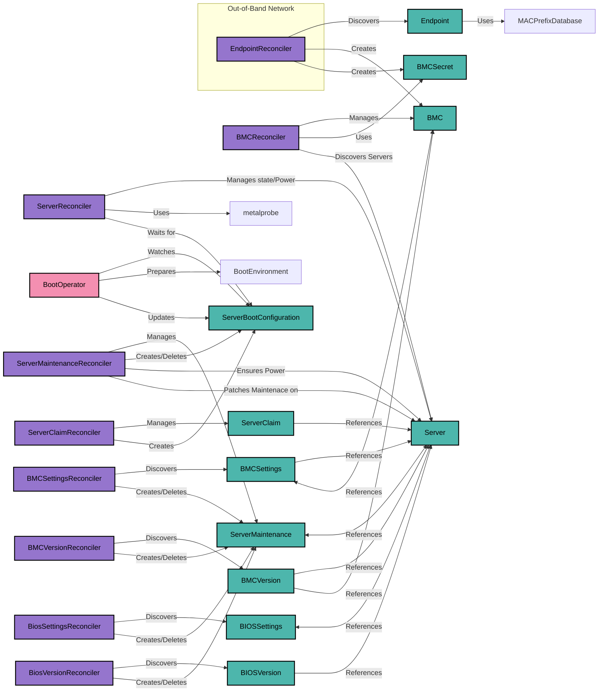

# Metal-Operator Architectural Description

The **metal-operator** is a Kubernetes operator designed to manage bare metal servers within a Kubernetes environment. 
It automates the provisioning, configuration, and lifecycle management of physical servers by integrating them into 
Kubernetes using Custom Resource Definitions (CRDs) and controllers. The architecture promotes modularity, scalability, 
and flexibility, enabling seamless integration with various boot mechanisms and provisioning tools.

## Architectural Diagram

## Key Components

### 1. Custom Resource Definitions (CRDs)

- [**Endpoint**](concepts/endpoints.md): Represents devices on the out-of-band management network, identified by MAC and IP addresses.
- [**BMC**](concepts/bmcs.md): Models Baseboard Management Controllers (BMCs), allowing interaction with server hardware.
- [**BMCSecret**](concepts/bmcsecrets.md): Securely stores credentials required to access BMCs.
- [**Server**](concepts/servers.md): Represents physical servers, managing their state, power, and configurations.
- [**ServerClaim**](concepts/serverclaims.md): Allows users to reserve servers by specifying desired configurations and boot images.
- [**ServerBootConfiguration**](concepts/serverbootconfigurations.md): Signals the need to prepare the boot environment for a server.
- [**ServerMaintenance**](concepts/servermaintenance.md): Represents maintenance tasks for servers, such as BIOS updates or hardware repairs.
- [**BIOSSettings**](concepts/biossettings.md): Handles updating the BIOS setting on the physical server's BIOS.
- [**BIOSVersion**](concepts/biosversion.md): Handles upgrading the BIOS Version on the physical server's BIOS.
- [**BMCSettings**](concepts/bmcsettings.md): Handles updating the BMC setting on the physical server's Manager.
- [**BMCVersion**](concepts/bmcversion.md): Handles upgrading the BMC Version on the physical server's Manager.
- [**ServerMaintenanceSet**](concepts/servermaintenanceset.md): Manages a set of ServerMaintenances.

### 2. Controllers

- **EndpointReconciler**: Discovers devices on the out-of-band network by processing `Endpoint` resources. It uses a **MAC Prefix Database** to identify device types, vendors, protocols, and default credentials. When a BMC is detected, it creates corresponding `BMC` and `BMCSecret` resources.

- **BMCReconciler**: Manages `BMC` resources by connecting to BMC devices using credentials from `BMCSecret`. It retrieves hardware information, updates the BMC status, and detects managed servers, creating `Server` resources for them.

- **ServerReconciler**: Manages `Server` resources and their lifecycle states. During the **Discovery** phase, it interacts with BMCs and uses the **metalprobe** agent to collect in-band hardware information, updating the server's status. It handles power management, BIOS configurations, and transitions servers through various states (e.g., Initial, Discovery, Available, Reserved).

- **ServerClaimReconciler**: Handles `ServerClaim` resources, allowing users to reserve servers. Upon creation of a `ServerClaim`, it allocates an available server, transitions it to the **Reserved** state, and creates a `ServerBootConfiguration`. When the claim is deleted, it releases the server, transitioning it to the **Cleanup** state for sanitization.

- **BIOSSettingsReconciler**: Handles [`BIOSSettings`](concepts/biossettings.md) resource. Provides ability to update the bios settings on physical server's BIOS.
- **BiosVersionReconciler**: Handles [`BIOSVersion`](concepts/biosversion.md) resource. Provides ability to upgrade the bios version on physical server's BIOS.
- **BMCSettingsReconciler**: Handles [`BMCSettings`](concepts/bmcsettings.md) resource. Provides ability to update the bmc settings on physical server's Manager.
- **BMCVersionReconciler**: Handles [`BMCVersion`](concepts/bmcversion.md) resource. Provides ability to upgrade the bmc version on physical server's Manager.

- **Boot Operator (External Component)**: Monitors `ServerBootConfiguration` resources to prepare the boot environment (e.g., configuring DHCP, PXE servers). Once the boot environment is ready, it updates the `ServerBootConfiguration` status to **Ready**.

## Workflow Summary

1. **Discovery and Initialization**:
    - The **EndpointReconciler** discovers devices on the out-of-band network, creating `Endpoint` resources.
    - BMCs are identified using the MAC Prefix Database, leading to the creation of `BMC` and `BMCSecret` resources.
    - The **BMCReconciler** connects to BMCs, gathers hardware details, and creates `Server` resources for each managed server.

2. **Server Discovery Phase**:
    - The **ServerReconciler** enters the **Discovery** phase, interacting with BMCs and booting servers using a predefined ignition.
    - The **metalprobe** agent runs on the servers, collecting detailed hardware information (e.g., network interfaces, storage devices) and reporting back to update the `Server` status.

3. **Server Availability**:
    - Once discovery is complete, servers transition to the **Available** state, ready to be claimed.

4. **Server Reservation and Boot Configuration**:
    - Users create `ServerClaim` resources to reserve servers, specifying desired OS images and ignition configurations.
    - The **ServerClaimReconciler** allocates servers, transitions them to the **Reserved** state, and creates `ServerBootConfiguration` resources.

5. **Boot Environment Preparation**:
    - External components (e.g., **boot-operator**) watch for `ServerBootConfiguration` resources and prepare the boot environment accordingly.
    - Once the environment is ready, they update the `ServerBootConfiguration` status to **Ready**.

6. **Server Power-On and Usage**:
    - The **ServerReconciler** detects the ready status and powers on the server.
    - The server boots using the specified image and ignition configuration.

7. **Cleanup and Maintenance**:
    - When a `ServerClaim` is deleted, the server transitions to the **Cleanup** state.
    - The **ServerReconciler** performs sanitization tasks (e.g., wiping disks, resetting configurations) before returning the server to the **Available** state.
    - Servers can enter the **Maintenance** state for updates or repairs.

## Architectural Benefits

- **Modularity**: Separation of concerns allows for flexible integration with various boot mechanisms and provisioning tools (e.g., OpenStack Ironic, custom solutions).
- **Scalability**: Automates the management of large numbers of servers through Kubernetes CRDs and controllers.
- **Extensibility**: Supports customization through additional CRDs and operators, enabling adaptation to specific infrastructure needs.
- **Security**: Manages sensitive information like BMC credentials using Kubernetes Secrets and enforces access control via RBAC policies.
- **Automation**: Streamlines hardware provisioning, configuration, and lifecycle management, reducing manual intervention and potential errors.
