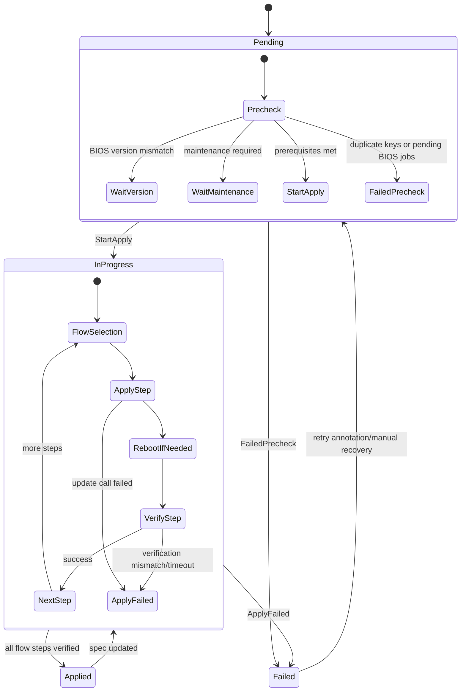

# BIOSSettings

`BIOSSettings` applies ordered BIOS configuration changes on exactly one `Server`.

It is intended for granular, per-server Day-2 operations where you need deterministic sequencing (`settingsFlow`) and safety gates (version check, maintenance, verification).

## What It Does

- Ensures one target server (`spec.serverRef`) converges to the desired BIOS settings.
- Applies settings in priority order from `spec.settingsFlow`.
- Waits until the server BIOS version equals `spec.version` before mutating settings.
- Requests or reuses `ServerMaintenance` to safely apply potentially disruptive changes.
- Verifies resulting settings and records progress in status and conditions.

## Spec Reference

| Field | Required | Description |
|---|---|---|
| `spec.serverRef.name` | No | Target server name. Immutable after creation. Required for the resource to function. |
| `spec.version` | Yes | BIOS version gate. Settings are applied only when this version is active. |
| `spec.settingsFlow[]` | No | Ordered list of settings batches to apply. If empty, object is marked `Applied`. |
| `spec.settingsFlow[].name` | Yes | Logical flow step name. Must be unique within the object. |
| `spec.settingsFlow[].priority` | Yes | Execution order; lower number executes first. |
| `spec.settingsFlow[].settings` | No | Map of BIOS key/value pairs for the step. |
| `spec.serverMaintenancePolicy` | No | Maintenance policy used when creating maintenance. |
| `spec.serverMaintenanceRef` | No | Optional existing `ServerMaintenance` reference. |

## Status Fields In Detail

| Field | What it means | How to use it for debugging |
|---|---|---|
| `status.state` | High-level lifecycle (`Pending`, `InProgress`, `Applied`, `Failed`). | First signal to decide if issue is a prerequisite wait vs active failure. |
| `status.flowState[].name` | Name of the flow item from `spec.settingsFlow`. | Identifies which step is currently blocked/failing. |
| `status.flowState[].priority` | Priority of the flow item. | Confirms execution ordering and whether a lower-priority step is waiting by design. |
| `status.flowState[].flowState` | Per-step state (`Pending`, `InProgress`, `Applied`, `Failed`). | Pinpoints exact stage that failed instead of only top-level state. |
| `status.flowState[].conditions[]` | Per-step detailed conditions. | Look for reason/message around validation, apply, and verification. |
| `status.lastAppliedTime` | Last time a setting step was successfully applied. | Useful to detect stuck progression if time does not move. |
| `status.conditions[]` | Resource-level conditions (version gate, maintenance wait, duplicate keys, verification, reboot). | Primary source for error reason and next action. |

## Detailed State Machine



## Detailed Workflow (All Main Cases)

1. Request intake:
  - Controller reads `spec.serverRef` and binds server ownership reference.
  - If server does not exist, object stays `Pending`.
2. Flow validation:
  - Checks duplicate flow names and duplicate settings keys across the flow.
  - Checks pending BIOS jobs on the target BMC.
  - Validation errors move resource to `Failed`.
3. Drift detection:
  - Controller computes desired-vs-actual settings diff.
  - Empty diff with no pending conditions moves to `Applied`.
4. Version gate:
  - If `spec.version` does not match current BIOS version, remain `Pending`.
  - Processing continues automatically when BIOS upgrade converges.
5. Maintenance orchestration:
  - Reuses `spec.serverMaintenanceRef` when provided.
  - Otherwise requests maintenance according to `spec.serverMaintenancePolicy`.
  - Waits until server enters maintenance mode.
6. Step execution:
  - Select next non-applied flow step by priority.
  - Issue settings update for that step.
  - Track per-step condition updates in `status.flowState[].conditions`.
7. Reboot path:
  - If vendor reports reboot required, controller performs power off/on sequence.
  - If not required, controller skips reboot and continues.
8. Verification:
  - Re-read settings and compare with desired values for current step.
  - On mismatch/timeouts, mark step and resource `Failed`.
9. Completion and cleanup:
  - When all steps are applied, top-level state becomes `Applied`.
  - Self-managed maintenance refs are removed.

## Troubleshooting Guide

| Symptom | Where to check | Likely cause | Action |
|---|---|---|---|
| Stuck in `Pending` | `status.conditions[]` | BIOS version mismatch or maintenance not approved | Complete `BIOSVersion` first or approve maintenance. |
| Immediate `Failed` after create | `status.conditions[]`, `spec.settingsFlow` | Duplicate flow names/settings keys or pending BIOS jobs | Fix flow uniqueness or wait/clear pending BIOS tasks, then retry. |
| `InProgress` for long time | `status.flowState[]`, `status.lastAppliedTime` | Slow apply, reboot not completed, or BMC connectivity issues | Check server power state and BMC reachability; inspect per-step condition message. |
| `Applied` but expected changes missing | `status.flowState[].conditions`, actual BIOS settings | Vendor normalization or wrong setting keys/values | Validate vendor-supported key/value pair naming and expected normalized value. |
| Cannot delete resource | resource finalizers and maintenance refs | Update still active or maintenance refs not yet cleaned | Wait for non-`InProgress` terminal state or resolve orphan maintenance resources. |

## Example

```yaml
apiVersion: metal.ironcore.dev/v1alpha1
kind: BIOSSettings
metadata:
  name: biossettings-sample
spec:
  serverRef:
    name: endpoint-sample-system-0
  version: P79 v1.45 (12/06/2017)
  settingsFlow:
    - name: boot-order
      priority: 10
      settings:
        OneTimeBootMode: Enabled
        BootMode: Uefi
  serverMaintenancePolicy: OwnerApproval
```

## Related Resources

- Use `BIOSSettingsSet` for fleet rollout.
- Use `BIOSVersion`/`BIOSVersionSet` when firmware version must be changed.
