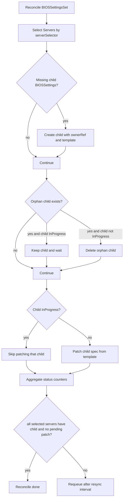

# BIOSSettingsSet

`BIOSSettingsSet` is the fleet-scoped controller input for creating and managing many `BIOSSettings` objects from one template.

## What It Does

- Selects `Server` objects using `spec.serverSelector`.
- Creates one child `BIOSSettings` per selected server.
- Keeps child specs aligned with `spec.biosSettingsTemplate`.
- Removes orphaned children when servers no longer match the selector.
- Aggregates rollout progress into status counters.

## Spec Reference

| Field | Required | Description |
|---|---|---|
| `spec.serverSelector` | Yes | Kubernetes label selector for target servers. |
| `spec.biosSettingsTemplate.version` | Yes | Desired BIOS version gate passed to each child `BIOSSettings`. |
| `spec.biosSettingsTemplate.settingsFlow[]` | No | Ordered settings flow copied into each child. |
| `spec.biosSettingsTemplate.serverMaintenancePolicy` | No | Maintenance policy copied into each child. |

## Status Fields In Detail

| Field | What it means | How to use it for debugging |
|---|---|---|
| `status.fullyLabeledServers` | Current server count matching selector. | If this is not expected, verify selector labels first. |
| `status.availableBIOSSettings` | Owned child `BIOSSettings` count. | If lower than selected servers, child creation is lagging/failing. |
| `status.pendingBIOSSettings` | Children not started yet. | High value usually means prerequisites blocked in many children. |
| `status.inProgressBIOSSettings` | Children actively reconciling. | Stable high value may indicate shared bottleneck (maintenance approvals, BMC access). |
| `status.completedBIOSSettings` | Children in terminal success (`Applied`). | Use to track rollout progress percentage. |
| `status.failedBIOSSettings` | Children in terminal failure. | Non-zero means inspect failed child objects immediately. |

## Detailed Reconcile Diagram



## Detailed Workflow (All Main Cases)

1. Selector evaluation:
  - Build target server set from `spec.serverSelector`.
  - Any label drift immediately changes desired child set.
2. Child creation path:
  - For each selected server without owned child, create `BIOSSettings`.
  - If server already references a valid external `BIOSSettings`, creation is skipped.
3. Orphan cleanup path:
  - Child whose `serverRef` is no longer selected is deleted.
  - Exception: child in `InProgress` is retained until safe to remove.
4. Template propagation path:
  - Non-`InProgress` children are patched from set template.
  - `InProgress` children are intentionally skipped to avoid disruptive mid-flight mutation.
5. Aggregation and requeue:
  - Status counters are recalculated from all owned children.
  - Controller requeues when desired and observed topology are not yet aligned.

## Troubleshooting Guide

| Symptom | Where to check | Likely cause | Action |
|---|---|---|---|
| `fullyLabeledServers` > `availableBIOSSettings` | set status + events | Child creation failures or API conflicts | Check controller logs and child create permissions/errors. |
| High `pendingBIOSSettings` for long time | child `BIOSSettings` status/conditions | Shared prerequisites blocked (version/maintenance/BMC access) | Inspect one pending child deeply; resolve root blocker globally. |
| `failedBIOSSettings` increases | failed child objects | Invalid template settings or unsupported vendor keys | Fix template and allow children to retry. |
| Selector changed but old children remain | child states | Orphans are still `InProgress` and protected | Wait for terminal state or investigate stuck in-progress child. |

## Example

```yaml
apiVersion: metal.ironcore.dev/v1alpha1
kind: BIOSSettingsSet
metadata:
  name: biossettingsset-sample
spec:
  biosSettingsTemplate:
    version: P79 v1.45 (12/06/2017)
    serverMaintenancePolicy: OwnerApproval
    settingsFlow:
      - name: boot-profile
        priority: 10
        settings:
          BootMode: Uefi
  serverSelector:
    matchLabels:
      manufacturer: Contoso
```
