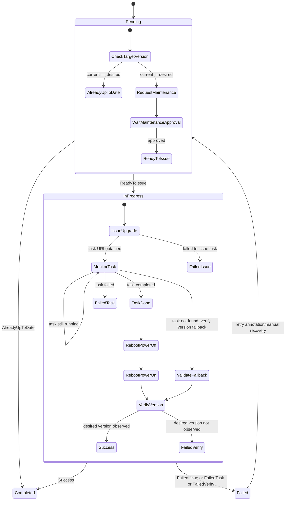

# BIOSVersion

`BIOSVersion` upgrades BIOS firmware for one `Server`.

It models a task-oriented firmware lifecycle (issue upgrade task, monitor completion, reboot/power-cycle flow, verify final version).

## What It Does

- Targets one server via `spec.serverRef`.
- Initiates Redfish-based BIOS upgrade using image metadata in `spec.image`.
- Tracks vendor task progress in `status.upgradeTask`.
- Uses `ServerMaintenance` gates before disruptive operations.
- Verifies final BIOS version before completing.

## Spec Reference

| Field | Required | Description |
|---|---|---|
| `spec.serverRef.name` | No | Target server. Immutable after creation. Required for the resource to function. |
| `spec.version` | Yes | Desired BIOS firmware version string. |
| `spec.image.URI` | Yes | Upgrade image URI. |
| `spec.image.transferProtocol` | No | Protocol to fetch image (for example `HTTPS`). |
| `spec.image.secretRef` | No | Secret reference for protected image source. |
| `spec.updatePolicy` | No | Vendor policy override. Current enum support is `Force`. |
| `spec.serverMaintenancePolicy` | No | Maintenance behavior for upgrade operations. |
| `spec.serverMaintenanceRef` | No | Optional pre-existing maintenance object. |

## Status Fields In Detail

| Field | What it means | How to use it for debugging |
|---|---|---|
| `status.state` | Lifecycle state (`Pending`, `InProgress`, `Completed`, `Failed`). | Tells whether issue is precheck, execution, or terminal failure. |
| `status.upgradeTask.URI` | Vendor task endpoint for firmware update. | Missing URI after issue attempt indicates upgrade issue path failed early. |
| `status.upgradeTask.state` | Task runtime state from BMC. | Detect running vs suspended vs terminal failure behavior. |
| `status.upgradeTask.status` | Health/status of task. | Correlate with failure reason when task does not complete. |
| `status.upgradeTask.percentageComplete` | Progress percent. | Flat progress over long duration indicates stalled vendor task. |
| `status.conditions[]` | Step checkpoints (maintenance, issue, completion, reboot, verify). | Most precise source of failure reason and next remediation step. |

## Detailed State Machine



## Detailed Workflow (All Main Cases)

1. Prechecks:
  - Validate `serverRef` and reach BMC through the server.
  - If server/BMC is temporarily unavailable, reconcile requeues.
2. Version short-circuit:
  - If current BIOS version already equals desired, mark `Completed`.
3. Maintenance path:
  - Ensure `ServerMaintenance` exists (reuse provided ref or create one).
  - Wait for server maintenance approval and maintenance state.
4. Upgrade issue path:
  - Call firmware update endpoint with `spec.image` and policy.
  - Persist task metadata to `status.upgradeTask`.
5. Task monitor path:
  - Poll task status until completed/failed.
  - If task object disappears, perform fallback version verification.
6. Reboot path:
  - Enforce power off then power on when required.
  - Wait for power-state convergence before verification.
7. Verification path:
  - Re-read BIOS version from BMC.
  - On match -> `Completed`, else -> `Failed`.
8. Cleanup path:
  - Remove self-managed maintenance references after terminal completion.

## Troubleshooting Guide

| Symptom | Where to check | Likely cause | Action |
|---|---|---|---|
| Stuck in `Pending` | `status.conditions[]` | Maintenance not approved or BMC unavailable | Approve maintenance; validate BMC connectivity and credentials. |
| `InProgress` with empty or missing `upgradeTask` | `status.conditions[]` | Firmware issue request failed | Verify image URI/protocol/secret and vendor update capability. |
| `upgradeTask` not progressing | `status.upgradeTask.*` | Vendor task stalled | Inspect BMC task endpoint and event logs; retry if safe. |
| Task missing but still not `Completed` | `status.conditions[]` + current BIOS version | Vendor deleted task before version reflected | Wait for BMC stabilization, then re-verify version. |
| `Failed` after reboot | `status.conditions[]` | Final version mismatch or interrupted power sequence | Validate supported upgrade path and power-state transitions. |

## Example

```yaml
apiVersion: metal.ironcore.dev/v1alpha1
kind: BIOSVersion
metadata:
  name: biosversion-sample
spec:
  serverRef:
    name: endpoint-sample-system-0
  version: P80 v1.45 (12/06/2017)
  image:
    URI: https://fw.example.com/contoso/bios/P80-v1.45.fwpkg
    transferProtocol: HTTPS
  updatePolicy: Force
  serverMaintenancePolicy: OwnerApproval
```
