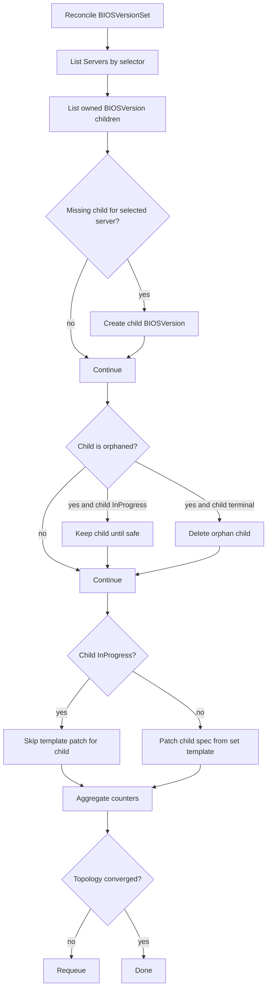

# BIOSVersionSet

`BIOSVersionSet` performs BIOS firmware rollout across multiple servers selected by labels.

## What It Does

- Selects target servers with `spec.serverSelector`.
- Creates and owns one `BIOSVersion` child per selected server.
- Patches child specs from `spec.biosVersionTemplate` when safe.
- Deletes orphan children when servers leave the selector.
- Surfaces rollout progress via aggregate status counters.

## Spec Reference

| Field | Required | Description |
|---|---|---|
| `spec.serverSelector` | Yes | Label selector for target servers. |
| `spec.biosVersionTemplate.version` | Yes | Target BIOS version for all selected servers. |
| `spec.biosVersionTemplate.image.URI` | Yes | Firmware image location. |
| `spec.biosVersionTemplate.image.transferProtocol` | No | Retrieval protocol, e.g. `HTTPS`. |
| `spec.biosVersionTemplate.image.secretRef` | No | Credentials for protected image source. |
| `spec.biosVersionTemplate.updatePolicy` | No | Policy override (`Force` currently supported). |
| `spec.biosVersionTemplate.serverMaintenancePolicy` | No | Maintenance behavior for children. |

## Status Fields In Detail

| Field | What it means | How to use it for debugging |
|---|---|---|
| `status.fullyLabeledServers` | Number of currently selected servers. | Confirms selector scope and rollout target size. |
| `status.availableBIOSVersion` | Number of owned child `BIOSVersion` objects. | If below selected count, child creation/update path is blocked. |
| `status.pendingBIOSVersion` | Children waiting to start. | Large values indicate prerequisite blocks in children. |
| `status.inProgressBIOSVersion` | Children actively upgrading. | Persistent high values indicate shared external bottleneck. |
| `status.completedBIOSVersion` | Successful terminal children. | Progress metric for rollout completion. |
| `status.failedBIOSVersion` | Failed terminal children. | Primary signal that rollout has hard failures to triage. |

## Detailed Reconcile Diagram



## Detailed Workflow (All Main Cases)

1. Selection and ownership:
  - Selector defines desired target set.
  - Existing children are discovered by owner reference.
2. Creation path:
  - Missing child is created for each selected server.
  - Name length edge cases are handled by generated names.
3. Deletion path:
  - Child is removed if parent no longer selects its server.
  - In-progress child deletion is deferred for safety.
4. Template patch path:
  - Non-in-progress child specs are reconciled to set template.
  - In-progress children are not patched to avoid mid-upgrade mutation.
5. Status aggregation:
  - Counters are recalculated each reconcile loop.
  - Requeue occurs until selected targets and available children align.

## Troubleshooting Guide

| Symptom | Where to check | Likely cause | Action |
|---|---|---|---|
| Rollout does not start for all selected servers | set counters (`fullyLabeledServers`, `availableBIOSVersion`) | Child creation failures | Inspect controller logs and API admission errors for child objects. |
| Many children remain `Pending` | child `BIOSVersion` conditions | Maintenance/version/image prerequisites not met | Fix common prerequisite (maintenance approval, image URI/secret). |
| `failedBIOSVersion` climbs after template change | failed child status/conditions | Invalid template content | Correct set template and retry failed children. |
| Old children remain after selector narrowing | child state | In-progress safety guard prevented deletion | Wait for terminal child states, then reconcile again. |

## Example

```yaml
apiVersion: metal.ironcore.dev/v1alpha1
kind: BIOSVersionSet
metadata:
  name: biosversionset-sample
spec:
  biosVersionTemplate:
    version: P80 v1.46 (12/06/2017)
    image:
      URI: https://fw.example.com/contoso/bios/P80-v1.46.fwpkg
      transferProtocol: HTTPS
    updatePolicy: Force
    serverMaintenancePolicy: OwnerApproval
  serverSelector:
    matchLabels:
      manufacturer: Contoso
```
