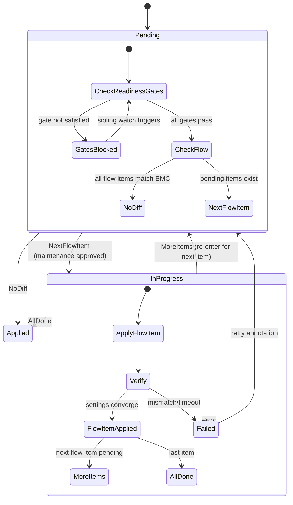

# BMCSettings / BMCVersion Redesign — SettingsFlow, VersionSelector, ReadinessGates, List-Ref

<!-- SPDX-FileCopyrightText: 2025 SAP SE or an SAP affiliate company and IronCore contributors -->
<!-- SPDX-License-Identifier: Apache-2.0 -->

This document describes the full redesign of the `BMCSettings`, `BMCSettingsSet`, `BMCVersion`, and `BMCVersionSet` APIs introduced in metal-operator.

## Problem Statement

The original `BMCSettings` API has several structural limitations:

| Problem | Impact |
|---|---|
| Single `spec.version` string gate | Only one firmware version can be targeted; no way to have a fresh-install vs upgrade path |
| Flat `spec.settingsMap` | No phased application; all settings applied atomically in one maintenance window |
| `bmc.spec.bmcSettingRef` is a single pointer | If two `BMCSettingsSet` objects stamp the same BMC simultaneously, one overwrites the other (silent data loss) |
| Broken version comparison (`<` on opaque strings) | Vendor version strings are not semver-comparable; the `<` guard produces undefined ordering |
| No prerequisite sequencing across resources | A `BMCVersion` upgrade cannot wait for prerequisite `BMCSettings` to complete |
| `BMCSettingsSet` cannot filter by firmware version | All matching BMCs receive settings regardless of their current firmware |

---

## Design Decisions

### 1. `SettingsFlow` replaces `SettingsMap` + `Version`

`spec.settingsMap` and `spec.version` are replaced by `spec.settingsFlow: []BMCSettingsFlowItem`. Each item has a `name`, a `priority` (ordering within the flow), and its own `settings` map. Items are applied in ascending `priority` order, each in its own maintenance window.

**Why:** Enables phased application (e.g., safe defaults first, then aggressive tuning), and decouples the target version from individual setting groups. Version filtering moves to the Set level.

### 2. `VersionSelector` on `BMCSettingsSet`

`BMCSettingsSetSpec` gains a `versionSelector.versions: []string` field. When set, only BMCs whose `status.firmwareVersion` exactly matches one of the listed strings receive a stamped `BMCSettings` child.

**Why:** BMC firmware version strings are opaque, vendor-defined free-form strings (e.g., HPE `iLO 6 v1.70`, Dell `5.00.00.00`, Lenovo `TEI392M-2.50`). Semver parsing is impossible; exact-match is the only safe strategy. Filtering at the Set level is more maintainable than per-object gates.

### 3. `bmc.spec.bmcSettingRefs []` list replaces single pointer

`bmc.spec.bmcSettingRef *LocalObjectReference` is replaced by `bmc.spec.bmcSettingRefs []LocalObjectReference`. Each `BMCSettings` controller appends/removes its own entry idempotently.

**Why:** With multiple `BMCSettingsSet` objects targeting the same BMC, a single pointer causes a race: two controllers both write `bmcSettingRef`, and the last writer wins. A list eliminates the conflict entirely.

### 4. `ReadinessGates` on `BMCSettingsTemplate` and `BMCVersionTemplate`

Both templates gain `readinessGates: []ReadinessGate`. A gate specifies an external resource (`apiVersion/kind/name`) and a `conditionType` that must be `True` before the resource proceeds past `Pending`. Gate `scope: SetChild` is a special mode where the controller resolves the actual child object at runtime by scanning `ownerReferences` — enabling a `BMCVersionSet`-stamped gate to reference a `BMCSettingsSet` by name without knowing the generated child's name.

**Why:** Enables declarative prerequisite ordering across resource types (e.g., "apply these settings before updating firmware") without coupling controllers.

### 5. `priority` field for `BMCSettings` ordering

`BMCSettingsTemplate` gains a `priority int32` field (default `0`). The `shouldBMCSettingsRunBefore(a, b)` function uses `priority → creationTimestamp → name` ordering, mirroring the existing `ServerMaintenance` controller's `shouldRunBefore`. The broken `<` string comparison on versions is removed.

**Why:** The old version-string ordering is semantically wrong (opaque strings) and fragile. An explicit integer priority is unambiguous.

---

## API Changes

### New shared type: `ReadinessGate`

```go
type ReadinessGateScope string

const (
    ReadinessGateScopeDirect ReadinessGateScope = "Direct"
    ReadinessGateScopeSetChild ReadinessGateScope = "PerBMC"
)

// ReadinessGate blocks a resource in Pending until the referenced
// object has the specified condition set to True.
type ReadinessGate struct {
    // APIVersion of the referenced object. e.g. "metal.ironcore.dev/v1alpha1"
    APIVersion string `json:"apiVersion"`
    // Kind of the referenced object. e.g. "BMCSettings"
    Kind string `json:"kind"`
    // Name of the referenced object (or owning Set when Scope is PerBMC).
    Name string `json:"name"`
    // ConditionType that must be True on the referenced object.
    // +optional
    ConditionType string `json:"conditionType,omitempty"`
    // Scope controls how Name is resolved.
    // Global (default): Name is an exact object name.
    // PerBMC: Name is treated as the owning Set name; the controller
    //   resolves the sibling child stamped for this BMC via ownerReferences.
    // +optional
    // +kubebuilder:default=Global
    Scope ReadinessGateScope `json:"scope,omitempty"`
}
```

### `api/v1alpha1/bmc_types.go`

```go
// Before:
BMCSettingRef *v1.LocalObjectReference `json:"bmcSettingRef,omitempty"`

// After:
BMCSettingRefs []v1.LocalObjectReference `json:"bmcSettingRefs,omitempty"`
```

### `api/v1alpha1/bmcsettings_types.go`

```go
// New types:

type BMCSettingsFlowItem struct {
    // Name uniquely identifies this flow step within the BMCSettings.
    Name string `json:"name"`
    // Priority controls application order within the flow.
    // Lower numbers are applied first. Must be unique within the flow.
    Priority int32 `json:"priority"`
    // Settings is the map of BMC manager key=value settings for this step.
    // +optional
    Settings map[string]string `json:"settings,omitempty"`
}

type BMCSettingsFlowStatus struct {
    Name  string            `json:"name"`
    State BMCSettingsState  `json:"state"`
}

// BMCSettingsTemplate replaces the old Version + SettingsMap fields:

type BMCSettingsTemplate struct {
    // SettingsFlow is the ordered list of setting groups to apply.
    // Items are applied in ascending Priority order.
    // +optional
    SettingsFlow []BMCSettingsFlowItem `json:"settingsFlow,omitempty"`

    // Priority controls ordering when multiple BMCSettings target the same BMC.
    // Higher value runs first. Mirrors ServerMaintenance.spec.priority.
    // +optional
    // +kubebuilder:default=0
    Priority int32 `json:"priority,omitempty"`

    // ReadinessGates blocks this BMCSettings in Pending until all gates are satisfied.
    // +optional
    ReadinessGates []ReadinessGate `json:"readinessGates,omitempty"`

    // ServerMaintenancePolicy controls maintenance behaviour for affected servers.
    // +optional
    ServerMaintenancePolicy ServerMaintenancePolicy `json:"serverMaintenancePolicy,omitempty"`
}

// BMCSettingsStatus adds FlowState and LastAppliedTime:

type BMCSettingsStatus struct {
    // State is the overall lifecycle state.
    State BMCSettingsState `json:"state,omitempty"`
    // FlowState tracks per-step state within settingsFlow.
    // +optional
    FlowState []BMCSettingsFlowStatus `json:"flowState,omitempty"`
    // LastAppliedTime is when the BMCSettings last transitioned to Applied.
    // +optional
    LastAppliedTime *metav1.Time `json:"lastAppliedTime,omitempty"`
    // Conditions holds fine-grained status conditions.
    Conditions []metav1.Condition `json:"conditions,omitempty"`
}
```

Fields removed: `Version string`, `SettingsMap map[string]string`.

### `api/v1alpha1/bmcsettingsset_types.go`

```go
// New type:

type VersionSelector struct {
    // Versions is the list of exact firmware version strings to match.
    // If empty or omitted, all firmware versions are included.
    // +optional
    Versions []string `json:"versions,omitempty"`
}

// Added to BMCSettingsSetSpec:

// VersionSelector limits stamping to BMCs whose status.firmwareVersion
// exactly matches one of the listed strings.
// When omitted, all BMCs matching the BMCSelector are included.
// +optional
VersionSelector *VersionSelector `json:"versionSelector,omitempty"`
```

### `api/v1alpha1/bmcversion_types.go`

```go
// Added to BMCVersionTemplate:

// ReadinessGates blocks this BMCVersion in Pending until all gates are satisfied.
// +optional
ReadinessGates []ReadinessGate `json:"readinessGates,omitempty"`
```

---

## Example CRDs

### BMCSettingsSet — version-gated, two-phase flow

```yaml
apiVersion: metal.ironcore.dev/v1alpha1
kind: BMCSettingsSet
metadata:
  name: ilo6-v170-baseline
spec:
  bmcSelector:
    matchLabels:
      metal.ironcore.dev/bmc-vendor: hpe
  versionSelector:
    versions:
      - "iLO 6 v1.70"
  template:
    metadata:
      labels:
        app.kubernetes.io/managed-by: ilo6-v170-baseline
    spec:
      priority: 10
      readinessGates: []
      settingsFlow:
        - name: safe-defaults
          priority: 0
          settings:
            SyslogServer: "10.0.0.5"
            SNMPv3AuthProtocol: SHA256
        - name: performance-tuning
          priority: 10
          settings:
            HPManagementNetworkWorkloads: Enabled
            ProcHyperthreading: Enabled
      serverMaintenancePolicy: Enforced
```

### BMCVersionSet — waits for BMCSettingsSet to complete

```yaml
apiVersion: metal.ironcore.dev/v1alpha1
kind: BMCVersionSet
metadata:
  name: ilo6-v170-upgrade
spec:
  bmcSelector:
    matchLabels:
      metal.ironcore.dev/bmc-vendor: hpe
  template:
    metadata:
      labels:
        app.kubernetes.io/managed-by: ilo6-v170-upgrade
    spec:
      version: "iLO 6 v1.70"
      readinessGates:
        - apiVersion: metal.ironcore.dev/v1alpha1
          kind: BMCSettings
          name: ilo6-v170-baseline          # name of the BMCSettingsSet
          conditionType: Applied
          scope: SetChild                     # resolved to this BMC's child at runtime
      serverMaintenancePolicy: Enforced
```

### BMC status with multiple setting refs

```yaml
status:
  firmwareVersion: "iLO 6 v1.58"
  bmcSettingRefs:
    - name: ilo6-v170-baseline-abc12
    - name: corp-security-hardening-xyz89
```

---

## Status Examples

### BMCSettings mid-flow

```yaml
status:
  state: InProgress
  flowState:
    - name: safe-defaults
      state: Applied
    - name: performance-tuning
      state: InProgress
  conditions:
    - type: ReadinessGatesSatisfied
      status: "True"
    - type: MaintenanceInProgress
      status: "True"
    - type: ResetIssued
      status: "True"
```

### BMCVersion blocked on gate

```yaml
status:
  state: Pending
  conditions:
    - type: ReadinessGatesSatisfied
      status: "False"
      reason: GateNotSatisfied
      message: "BMCSettings ilo6-v170-baseline-abc12 condition Applied is False"
```

---

## Workflow Diagram



---

## Race Condition Analysis

| # | Scenario | Resolution |
|---|---|---|
| RC1 | Two Sets stamp same BMC simultaneously | `bmcSettingRefs` list — both append their own entry; no conflict |
| RC2 | v1.0 settings stamped before prereqs Applied | `readinessGates scope=SetChild` blocks in Pending; sibling watch re-triggers reactively |
| RC3 | BMCVersion starts before prerequisite settings Applied | Same gate mechanism blocks BMCVersion in Pending |
| RC4 | Two BMCSettings request maintenance simultaneously | `shouldBMCSettingsRunBefore` (priority→creationTimestamp→name) serialises; incumbent `InProgress` is never evicted |
| RC5 | BMCVersionSet uses `GenerateName` — child name unknown at gate authoring time | Gates reference the Set name; `scope=SetChild` resolves child at runtime via ownerRef scan |
| RC6 | `versionSelector` stamps before firmware upgrade completes | `bmc_controller` writes `status.firmwareVersion` only after Redfish confirms; no gap |

---

## Priority Ordering (`shouldBMCSettingsRunBefore`)

Mirrors `shouldRunBefore` in `servermaintenance_controller.go`:

```go
func shouldBMCSettingsRunBefore(a, b *metalv1alpha1.BMCSettings) bool {
    if a.Spec.Priority != b.Spec.Priority {
        return a.Spec.Priority > b.Spec.Priority // higher value runs first
    }
    if !a.CreationTimestamp.Equal(&b.CreationTimestamp) {
        return a.CreationTimestamp.Before(&b.CreationTimestamp)
    }
    return a.Name < b.Name
}
```

An incumbent in `InProgress` is **never** evicted regardless of the challenger's priority.

## Priority vs ReadinessGates

| | `priority` | `readinessGates` |
|---|---|---|
| **Question answered** | *Which one goes first?* | *Can I start at all?* |
| **Mechanism** | Relative integer ordering between competing `BMCSettings` on the same BMC | Block in Pending until an external object reaches a condition |
| **Coupling** | Fully decoupled — each object sets its own value independently | Explicit cross-reference — the blocked object must name the dependency |
| **Use case** | "Security settings should always win the active slot over performance tuning" | "Don't start firmware upgrade until settings are Applied" |

You could simulate priority using gates — put a gate on B pointing at A's `Applied` condition. But that only works when A and B are known to each other at authoring time, and it doesn't handle the general case where two independently-created Sets both target the same BMC and you want one to naturally outrank the other without them knowing about each other. **Both fields are needed.**

---

## Implementation Steps

### Phase 1 — API types

1. Add `ReadinessGate` / `ReadinessGateScope` to a new `api/v1alpha1/readinessgate_types.go`
2. `bmc_types.go`: rename `BMCSettingRef` → `BMCSettingRefs []`
3. `bmcsettings_types.go`: add `BMCSettingsFlowItem`, `BMCSettingsFlowStatus`; replace `Version`+`SettingsMap` with `SettingsFlow`, `Priority`, `ReadinessGates`; add `FlowState`+`LastAppliedTime` to status
4. `bmcsettingsset_types.go`: add `VersionSelector`
5. `bmcversion_types.go`: add `ReadinessGates` to `BMCVersionTemplate`
6. `make generate` — regenerate deepcopy + CRD manifests

### Phase 2 — BMCSettings controller

7. Add `addBMCSettingRef` / `removeBMCSettingRef` list-aware helpers (idempotent)
8. Remove broken `<` version string comparison; add `shouldBMCSettingsRunBefore`
9. Add `checkReadinessGates()` — `scope=Global` does a direct Get; `scope=SetChild` scans `bmcSettingRefs` and filters by ownerRef
10. Thread flow-item iteration through `handleSettingInProgressState`: apply per-item, persist `flowState`, loop back to Pending for next item
11. Add sibling Watch on `BMCSettings` → re-enqueue all `BMCSettings` sharing the same `bmcSettingRefs` entry

### Phase 3 — BMCSettingsSet controller

12. In `createMissingBMCSettings`: skip BMC when `versionSelector.versions` is non-empty and `bmc.status.firmwareVersion` not in the list
13. Remove stale "BMC already has BMCSettingRef, skip" guard
14. Add Watch on `BMC` for `status.firmwareVersion` changes → re-enqueue owning `BMCSettingsSet`

### Phase 4 — BMCVersion controller

15. In Pending case: call `checkReadinessGates()` before `removeServerMaintenanceRefAndResetConditions`
16. Add `ReadinessGatesSatisfied` condition (`True`/`False`)
17. Add Watch on `BMCSettings` → enqueue `BMCVersions` whose gates reference that `BMCSettings`

### Phase 5 — BMCVersionSet controller

18. Deep-copy `ReadinessGates` verbatim in `createMissingBMCVersions` (follows existing template copy)

### Phase 6 — Manifests, samples, docs

19. `make manifests` — regenerate CRD YAML
20. Update/add `config/samples/metal_v1alpha1_bmcsettings.yaml`, `metal_v1alpha1_bmcsettingsset.yaml`, `metal_v1alpha1_bmcversionset.yaml`
21. Update `docs/concepts/bmcsettings.md`, `bmcsettingsset.md`, `bmcversion.md`

### Phase 7 — Tests

22. Update existing `bmcsettings_controller_test.go` for new API (flow items, list refs)
23. Add integration test: two `BMCSettingsSet` objects → same BMC → list ref populated; gate sequencing; `versionSelector` filtering

---

## Backward Compatibility

- `BMCSettings` objects without `settingsFlow` are no-ops (no diff, transition to `Applied`)
- `BMCSettingsSet` objects without `versionSelector` continue to target all matched BMCs
- `BMC` objects with no `bmcSettingRefs` are processed normally
- `BMCVersionTemplate` without `readinessGates` behaves identically to the current implementation
- The field rename `bmcSettingRef` → `bmcSettingRefs` requires a one-time migration of existing objects (controller handles both during a transition period using a compatibility shim)
