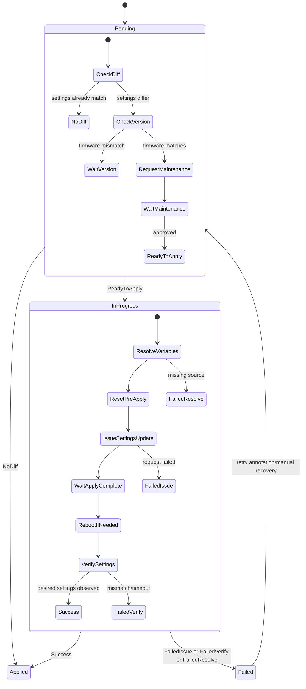

# BMCSettings

`BMCSettings` applies BMC manager settings for one `BMC` resource.

Unlike BIOS settings on a single host, BMC settings may require maintenance for multiple servers managed by the same BMC.

## What It Does

- Targets one BMC through `spec.BMCRef`.
- Compares desired `spec.settings` against current manager settings.
- Resolves `spec.variables` references against the BMCSettings object, ConfigMaps, and Secrets before applying.
- Waits for expected BMC firmware version (`spec.version`) before applying changes.
- Requests `ServerMaintenance` for related servers when needed.
- Applies settings, performs reset/reboot handling, then verifies convergence.

## Spec Reference

| Field | Required | Description |
|---|---|---|
| `spec.BMCRef.name` | Yes | Target BMC object. Immutable after creation. |
| `spec.version` | Yes | Required BMC firmware version gate for settings apply. |
| `spec.settings` | No | Map of BMC manager settings to enforce. Values may reference variables using `$(VarName)` syntax. |
| `spec.variables[]` | No | List of named variables resolved at apply time and substituted into `spec.settings` values. Max 64 items. |
| `spec.serverMaintenancePolicy` | No | Maintenance policy for affected servers. |
| `spec.serverMaintenanceRefs[]` | No | Existing maintenance refs, typically controller-managed. |

Note: The API field is `BMCRef` (capitalized) in this CRD schema.

### Variables

`spec.variables` allows setting values to be resolved dynamically at apply time.
Each variable has a `key` (referenced as `$(key)` in settings values) and exactly one source via `valueFrom`.

Variables are resolved in list order — a variable may use `$(PreviousVarKey)` in its `configMapKeyRef.key` or `secretKeyRef.key` if the referenced variable is defined earlier in the list.

Resolution order within a single variable:
1. `fieldRef` — reads a field from the BMCSettings object itself.
2. `configMapKeyRef` — reads a key from a ConfigMap (key name may contain `$(VarName)` substitutions).
3. `secretKeyRef` — reads a key from a Secret (key name may contain `$(VarName)` substitutions).

#### `valueFrom.fieldRef`

| Field | Required | Description |
|---|---|---|
| `fieldPath` | Yes | Field path on the BMCSettings object, e.g. `spec.BMCRef.name`. Min 1, max 256 chars. |

#### `valueFrom.configMapKeyRef` / `valueFrom.secretKeyRef`

| Field | Required | Description |
|---|---|---|
| `name` | Yes | Object name. Max 253 chars. |
| `namespace` | Yes | Object namespace. Max 63 chars. |
| `key` | Yes | Key within the object. May contain `$(VarName)` substitutions. Max 253 chars. |

Validation guarantees:
- Exactly one of `fieldRef`, `configMapKeyRef`, or `secretKeyRef` per variable.
- Variable `key` values must be unique within the list.
- Variable `key` is 1–63 characters.

## Status Fields In Detail

| Field | What it means | How to use it for debugging |
|---|---|---|
| `status.state` | Lifecycle state (`Pending`, `InProgress`, `Applied`, `Failed`). | Immediate indicator of blocked prerequisites vs execution failure. |
| `status.conditions[]` | Fine-grained checkpoints: version gate, maintenance waiting/progress, reset, issue/verify results. | Primary source for error reason and where in workflow it failed. Use alongside `spec.serverMaintenanceRefs[]` to diagnose prolonged maintenance waits. |

## Detailed State Machine



## Detailed Workflow (All Main Cases)

1. Intake and ownership:
  - Resolve `BMCRef` and bind BMC-side reference.
  - Ensure finalizer and ownership links are in place.
2. Diff and version gate:
  - If no settings diff exists, transition to `Applied`.
  - If diff exists and version mismatches, remain `Pending`.
3. Maintenance orchestration:
  - Discover all servers associated with the BMC.
  - Request maintenance per server (policy driven) and wait for approval.
4. Variable resolution:
  - Resolve each variable in list order: `fieldRef` first, then `configMapKeyRef`/`secretKeyRef` with substitution.
  - Substitute `$(VarName)` placeholders into settings values.
5. Apply path:
  - Optional BMC reset to establish stable state.
  - Issue settings update and track progress via conditions.
6. Reboot/verification path:
  - Perform reset/reboot when required by vendor behavior.
  - Verify settings from BMC readback.
7. Terminalization and cleanup:
  - On success set `Applied`, on failure set `Failed`.
  - Remove self-managed maintenance references where applicable.

## Troubleshooting Guide

| Symptom | Where to check | Likely cause | Action |
|---|---|---|---|
| `Pending` with no movement | `status.conditions[]` | Firmware version gate not satisfied | Run/complete `BMCVersion` to desired version first. |
| Stuck waiting for maintenance | `spec.serverMaintenanceRefs[]`, conditions | One or more server maintenances not approved | Approve each pending server maintenance resource. |
| `InProgress` too long | conditions + BMC health | BMC reset/apply did not converge | Check BMC reachability and vendor-specific settings endpoint health. |
| `Failed` after apply | verify condition message | Unsupported key/value or readback mismatch | Validate exact vendor key names and normalized values. |
| `Failed` on variable resolution | conditions | Missing ConfigMap/Secret or wrong key | Check that all referenced objects and keys exist in the correct namespace. |
| Deletion blocked | finalizer + in-progress state | Active reconciliation and pending cleanup refs | Resolve active operation first, then retry deletion. |

## Example

```yaml
apiVersion: metal.ironcore.dev/v1alpha1
kind: BMCSettings
metadata:
  name: bmcsettings-sample
spec:
  BMCRef:
    name: endpoint-sample
  version: 1.45.455b66-rev4
  serverMaintenancePolicy: Enforced
  settings:
    BootMode: "UEFI"
    HyperThreading: "Enabled"
    LicenseKey: "$(LicenseKey)"
    FQDN: "$(BmcName).$(SearchDomain)"
  variables:
    - key: BmcName
      valueFrom:
        fieldRef:
          fieldPath: spec.BMCRef.name
    - key: SearchDomain
      valueFrom:
        configMapKeyRef:
          name: bmc-network-config
          namespace: metal-system
          key: search-domain
    - key: LicenseKey
      valueFrom:
        secretKeyRef:
          name: bmc-licenses
          namespace: metal-system
          key: $(BmcName)
```
