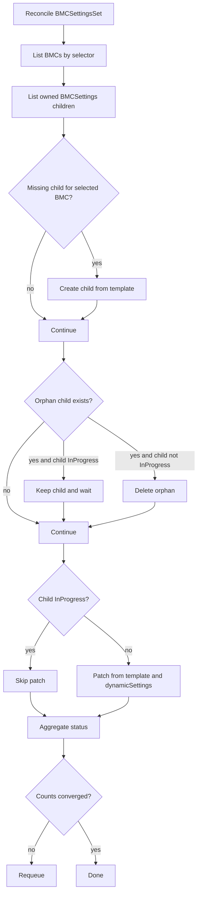

# BMCSettingsSet

`BMCSettingsSet` performs declarative BMC settings rollout across a label-selected BMC fleet.

## What It Does

- Selects BMCs by `spec.bmcSelector`.
- Creates one child `BMCSettings` per selected BMC.
- Copies `spec.bmcSettingsTemplate` into children.
- Supports per-BMC value materialization using `spec.dynamicSettings`.
- Deletes orphan children and aggregates rollout counters.

## Spec Reference

| Field | Required | Description |
|---|---|---|
| `spec.bmcSelector` | Yes | Label selector for target BMCs. |
| `spec.bmcSettingsTemplate.version` | Yes | Required BMC firmware version gate for children. |
| `spec.bmcSettingsTemplate.settings` | No | Base settings map copied into each child. |
| `spec.bmcSettingsTemplate.serverMaintenancePolicy` | No | Maintenance policy copied into children. |
| `spec.dynamicSettings[]` | No | Per-BMC computed settings merged into child spec. |

### Dynamic Settings

`dynamicSettings` provides per-target value resolution.

Each item defines:

- `key`: destination settings key.
- Exactly one of:
  - `valueFrom` (single source)
  - `format` plus `variables` (templated composition)

Allowed variable/source kinds:

- `bmcLabel`
- `configMapKeyRef` (`name`, `namespace`, `key`)
- `secretKeyRef` (`name`, `namespace`, `key`)

Validation guarantees:

- Exactly one source per variable.
- `format` requires non-empty `variables`.
- `variables` can only be used with `format`.

## Status Fields In Detail

| Field | What it means | How to use it for debugging |
|---|---|---|
| `status.fullyLabeledBMCs` | Number of BMCs matching selector. | Confirms fleet scope and label correctness. |
| `status.availableBMCSettings` | Number of owned child `BMCSettings`. | If low, child creation/ownership is failing. |
| `status.pendingBMCSettings` | Children not started yet. | Usually indicates downstream prerequisites blocked. |
| `status.inProgressBMCSettings` | Children currently applying settings. | Sustained high count implies shared backend issues. |
| `status.completedBMCSettings` | Children in terminal success (`Applied`). | Rollout completion progress indicator. |
| `status.failedBMCSettings` | Children in terminal failure. | Should trigger immediate child-level triage. |

## Detailed Reconcile Diagram



## Detailed Workflow (All Main Cases)

1. Selection:
  - Build desired BMC target set from selector labels.
2. Child creation:
  - Create missing `BMCSettings` child per selected BMC.
  - Skip creation if BMC already references a valid child.
3. Dynamic settings materialization:
  - Resolve `dynamicSettings` values from labels, ConfigMaps, and Secrets.
  - Merge resolved values into child settings payload.
4. Orphan cleanup:
  - Delete children whose BMC is no longer selected.
  - Protect in-progress children from deletion until safe.
5. Template propagation:
  - Patch only non-in-progress children.
  - Requeue until desired topology and child specs converge.
6. Rollout visibility:
  - Aggregate counters from child states each reconcile loop.

## Troubleshooting Guide

| Symptom | Where to check | Likely cause | Action |
|---|---|---|---|
| Child count below target count | `fullyLabeledBMCs` vs `availableBMCSettings` | Create failures or ownership conflicts | Check create errors, RBAC, and ownerRef validity. |
| `failedBMCSettings` rises after dynamic settings use | failed child conditions + source objects | Missing/invalid ConfigMap/Secret keys or label source | Validate source object namespace/name/key and label presence. |
| Many children stuck `Pending` | child conditions | Prerequisites not met in child workflow | Inspect one pending child and fix shared dependency. |
| Orphans not deleted | child state | Child in-progress safety guard | Wait for terminal state, then reconcile. |

## Example

```yaml
apiVersion: metal.ironcore.dev/v1alpha1
kind: BMCSettingsSet
metadata:
  name: bmcsettingsset-sample
spec:
  bmcSettingsTemplate:
    version: 1.45.455b66-rev4
    serverMaintenancePolicy: Enforced
    settings:
      BootMode: UEFI
  bmcSelector:
    matchLabels:
      manufacturer: dell
  dynamicSettings:
    - key: AssetTag
      valueFrom:
        bmcLabel: metal.ironcore.dev/asset-tag
    - key: FQDN
      format: $(hostname).$(domain)
      variables:
        hostname:
          bmcLabel: metal.ironcore.dev/hostname
        domain:
          configMapKeyRef:
            name: network-config
            namespace: metal-system
            key: domain-suffix
```