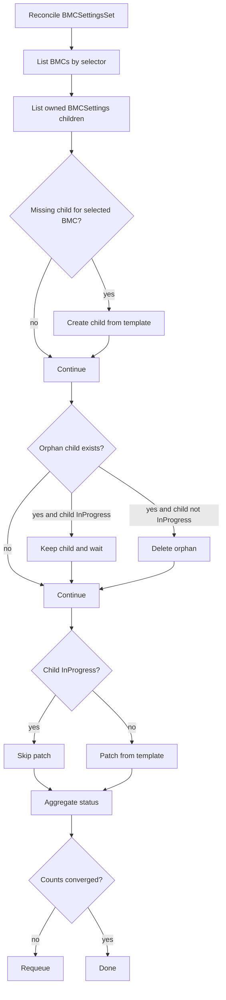

# BMCSettingsSet

`BMCSettingsSet` performs declarative BMC settings rollout across a label-selected BMC fleet.

## What It Does

- Selects BMCs by `spec.bmcSelector`.
- Creates one child `BMCSettings` per selected BMC.
- Copies `spec.bmcSettingsTemplate` (including `settings` and `variables`) into each child.
- Deletes orphan children and aggregates rollout counters.

## Spec Reference

| Field | Required | Description |
|---|---|---|
| `spec.bmcSelector` | Yes | Label selector for target BMCs. |
| `spec.bmcSettingsTemplate.version` | Yes | Required BMC firmware version gate for children. |
| `spec.bmcSettingsTemplate.settings` | No | Base settings map copied into each child. Values may reference variables using `$(VarName)` syntax. |
| `spec.bmcSettingsTemplate.variables[]` | No | Variables resolved at apply time in each child. Max 64 items. |
| `spec.bmcSettingsTemplate.serverMaintenancePolicy` | No | Maintenance policy copied into children. |

### Variables

`spec.bmcSettingsTemplate.variables` defines named variables that are copied verbatim into each child `BMCSettings`.
Resolution happens in the child controller at apply time, against the specific child object — not against the set.

Each variable has a `key` (used as `$(key)` in settings values) and exactly one source via `valueFrom`.
Variables are resolved in list order.

#### `valueFrom.fieldRef`

Reads a field from the child `BMCSettings` object. This is the idiomatic way to reference per-BMC identity (e.g. the BMC name).

| Field | Required | Description |
|---|---|---|
| `fieldPath` | Yes | Field path on the child BMCSettings object, e.g. `spec.BMCRef.name`. Min 1, max 256 chars. |

#### `valueFrom.configMapKeyRef` / `valueFrom.secretKeyRef`

Reads a key from a cluster-scoped ConfigMap or Secret.
The `key` field supports `$(VarName)` substitution using variables resolved earlier in the list.

| Field | Required | Description |
|---|---|---|
| `name` | Yes | Object name. Max 253 chars. |
| `namespace` | Yes | Object namespace. Max 63 chars. |
| `key` | Yes | Key within the object. May contain `$(VarName)` substitutions. Max 253 chars. |

Validation guarantees:
- Exactly one of `fieldRef`, `configMapKeyRef`, or `secretKeyRef` per variable.
- Variable `key` values must be unique within the list.
- Variable `key` is 1–63 characters.

## Status Fields In Detail

| Field | What it means | How to use it for debugging |
|---|---|---|
| `status.fullyLabeledBMCs` | Number of BMCs matching selector. | Confirms fleet scope and label correctness. |
| `status.availableBMCSettings` | Number of owned child `BMCSettings`. | If low, child creation/ownership is failing. |
| `status.pendingBMCSettings` | Children not started yet. | Usually indicates downstream prerequisites blocked. |
| `status.inProgressBMCSettings` | Children currently applying settings. | Sustained high count implies shared backend issues. |
| `status.completedBMCSettings` | Children in terminal success (`Applied`). | Rollout completion progress indicator. |
| `status.failedBMCSettings` | Children in terminal failure. | Should trigger immediate child-level triage. |

## Detailed Reconcile Diagram



## Detailed Workflow (All Main Cases)

1. Selection:
  - Build desired BMC target set from selector labels.
2. Child creation:
  - Create missing `BMCSettings` child per selected BMC.
  - Copy `bmcSettingsTemplate` (settings + variables) verbatim into the child.
3. Orphan cleanup:
  - Delete children whose BMC is no longer selected.
  - Protect in-progress children from deletion until safe.
4. Template propagation:
  - Patch only non-in-progress children.
  - Requeue until desired topology and child specs converge.
5. Rollout visibility:
  - Aggregate counters from child states each reconcile loop.

Note: Variable resolution is **not** done by the set controller. The variables list is copied into the child `BMCSettings` and resolved there at apply time against the specific child object.

## Troubleshooting Guide

| Symptom | Where to check | Likely cause | Action |
|---|---|---|---|
| Child count below target count | `fullyLabeledBMCs` vs `availableBMCSettings` | Create failures or ownership conflicts | Check create errors, RBAC, and ownerRef validity. |
| `failedBMCSettings` rises after variable use | failed child conditions + source objects | Missing/invalid ConfigMap/Secret keys or wrong fieldPath | Validate source object namespace/name/key and that `fieldPath` resolves on the child object. |
| Many children stuck `Pending` | child conditions | Prerequisites not met in child workflow | Inspect one pending child and fix shared dependency. |
| Orphans not deleted | child state | Child in-progress safety guard | Wait for terminal state, then reconcile. |

## Example

```yaml
apiVersion: metal.ironcore.dev/v1alpha1
kind: BMCSettingsSet
metadata:
  name: bmcsettingsset-sample
spec:
  bmcSelector:
    matchLabels:
      manufacturer: dell
      model: poweredge-r840
  bmcSettingsTemplate:
    version: 1.45.455b66-rev4
    serverMaintenancePolicy: Enforced
    settings:
      BootMode: UEFI
      HyperThreading: Enabled
      LicenseKey: $(LicenseKey)
      FQDN: $(BmcName).$(SearchDomain)
    variables:
      - key: BmcName
        valueFrom:
          fieldRef:
            fieldPath: spec.BMCRef.name
      - key: SearchDomain
        valueFrom:
          configMapKeyRef:
            name: bmc-network-config
            namespace: metal-system
            key: search-domain
      - key: LicenseKey
        valueFrom:
          secretKeyRef:
            name: bmc-licenses
            namespace: metal-system
            key: $(BmcName)
```
