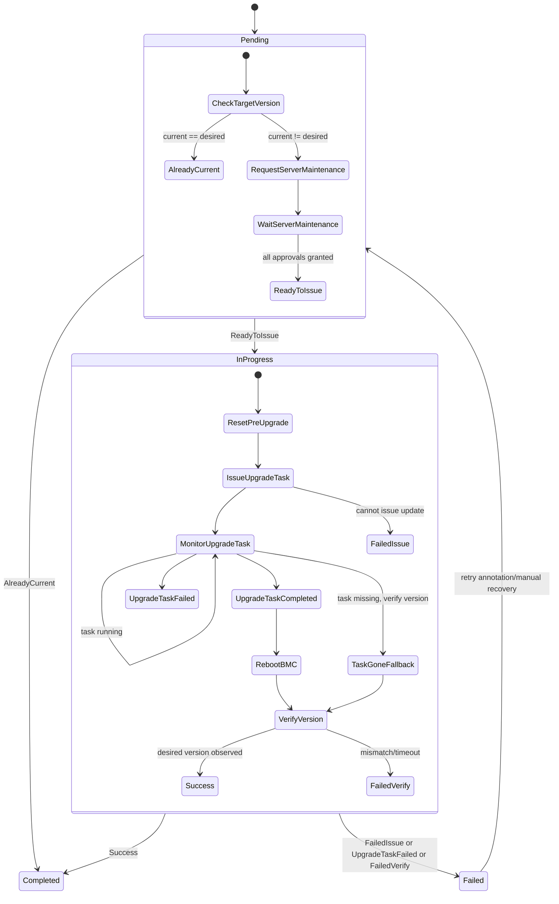

# BMCVersion

`BMCVersion` upgrades BMC firmware for one `BMC`.

It is the BMC counterpart of `BIOSVersion`, with additional multi-server maintenance gating because one BMC can manage multiple hosts.

## What It Does

- Targets one BMC via `spec.bmcRef`.
- Starts firmware update with image metadata from `spec.image`.
- Tracks BMC-reported task state in `status.upgradeTask`.
- Requests maintenance for associated servers (policy-driven).
- Resets BMC and verifies final firmware version before completion.

## Spec Reference

| Field | Required | Description |
|---|---|---|
| `spec.bmcRef.name` | No | Target BMC. Immutable after create. Required for the resource to function. |
| `spec.version` | Yes | Desired firmware version. |
| `spec.image.URI` | Yes | Firmware image URI. |
| `spec.image.transferProtocol` | No | Download protocol, such as `HTTPS`. |
| `spec.image.secretRef` | No | Secret credentials for image source. |
| `spec.updatePolicy` | No | Update override. Current supported enum value: `Force`. |
| `spec.serverMaintenancePolicy` | No | Maintenance policy for managed servers. |
| `spec.serverMaintenanceRefs[]` | No | Existing maintenance refs, typically controller-managed. |

## Status Fields In Detail

| Field | What it means | How to use it for debugging |
|---|---|---|
| `status.state` | Lifecycle (`Pending`, `InProgress`, `Completed`, `Failed`). | First triage dimension for blockers vs active failures. |
| `status.upgradeTask.URI` | Firmware task identifier on BMC. | Empty URI indicates issue stage failed before task creation. |
| `status.upgradeTask.state` | Task execution state. | Use to identify running vs terminal task behavior. |
| `status.upgradeTask.status` | Task health/status classification. | Correlate with failure reason in conditions. |
| `status.upgradeTask.percentageComplete` | Reported task progress. | Long flatlines indicate stalled vendor-side execution. |
| `status.conditions[]` | Maintenance wait, task issue/completion, reset, verification checkpoints. | Primary error location and action hints. |

## Detailed State Machine



## Detailed Workflow (All Main Cases)

1. Prechecks and references:
  - Resolve target BMC from `spec.bmcRef`.
  - Ensure ownership/finalizer and cleanup stale refs.
2. Version check:
  - If current firmware already equals desired version, transition to `Completed`.
3. Maintenance orchestration:
  - Identify all servers managed by BMC.
  - Request maintenance resources as needed and wait for approvals.
4. Upgrade issue:
  - Call BMC update endpoint with `spec.image` and policy.
  - Persist task data in `status.upgradeTask`.
5. Upgrade monitoring:
  - Poll task state and completion percentage.
  - Handle vendor task disappearance by fallback version verification.
6. Reset and verify:
  - Reset/reboot BMC when workflow requires it.
  - Read back version and compare against `spec.version`.
7. Terminalization:
  - Success path sets `Completed`.
  - Failure path sets `Failed` with reason-specific condition updates.

## Troubleshooting Guide

| Symptom | Where to check | Likely cause | Action |
|---|---|---|---|
| Stuck in `Pending` | `status.conditions[]`, maintenance refs | Server maintenance not approved | Approve all referenced maintenance resources. |
| No task URI after issue attempt | `status.conditions[]` | Invalid image URI/protocol/secret or vendor rejection | Validate image source and vendor update prerequisites. |
| Task progress frozen | `status.upgradeTask.percentageComplete` | BMC task stalled | Inspect BMC task endpoint/logs; retry after stabilization. |
| Task missing unexpectedly | condition messages + current version | Vendor cleaned task early | Use version readback to decide completion vs retry. |
| `Failed` after reset | verify condition | Version did not converge | Confirm supported upgrade path and perform controlled retry. |

## Example

```yaml
apiVersion: metal.ironcore.dev/v1alpha1
kind: BMCVersion
metadata:
  name: bmcversion-sample
spec:
  bmcRef:
    name: endpoint-sample
  version: 2.45.455b66-rev4
  image:
    URI: https://fw.example.com/contoso/bmc/2.45.455b66-rev4.bin
    transferProtocol: HTTPS
  updatePolicy: Force
  serverMaintenancePolicy: OwnerApproval
```
