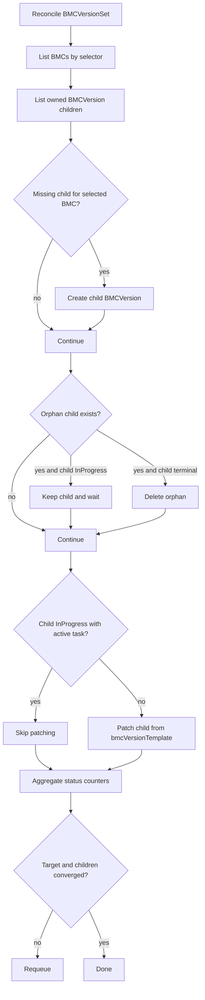

# BMCVersionSet

`BMCVersionSet` performs BMC firmware rollout for multiple BMCs selected by labels.

## What It Does

- Selects target BMCs using `spec.bmcSelector`.
- Creates one child `BMCVersion` per selected BMC.
- Patches child specs from `spec.bmcVersionTemplate` when safe.
- Deletes orphan children if BMCs leave selector scope.
- Aggregates child state into fleet-level status counters.

## Spec Reference

| Field | Required | Description |
|---|---|---|
| `spec.bmcSelector` | Yes | Label selector for target BMCs. |
| `spec.bmcVersionTemplate.version` | Yes | Target BMC firmware version for all selected BMCs. |
| `spec.bmcVersionTemplate.image.URI` | Yes | Firmware image location. |
| `spec.bmcVersionTemplate.image.transferProtocol` | No | Retrieval protocol, typically `HTTPS`. |
| `spec.bmcVersionTemplate.image.secretRef` | No | Secret credentials for image source. |
| `spec.bmcVersionTemplate.updatePolicy` | No | Update override (`Force` supported). |
| `spec.bmcVersionTemplate.serverMaintenancePolicy` | No | Maintenance policy for associated servers. |

## Status Fields In Detail

| Field | What it means | How to use it for debugging |
|---|---|---|
| `status.fullyLabeledBMCs` | Current selected BMC count. | Validates selector behavior and expected rollout scope. |
| `status.availableBMCVersion` | Number of owned child `BMCVersion` objects. | Gap to selected count indicates child creation issues. |
| `status.pendingBMCVersion` | Children waiting to start. | Indicates prerequisites not met in many children. |
| `status.inProgressBMCVersion` | Children currently upgrading. | Persistent high count suggests shared bottleneck (maintenance/BMC availability). |
| `status.completedBMCVersion` | Successful child upgrades. | Rollout completion signal. |
| `status.failedBMCVersion` | Failed child upgrades. | Immediate indicator to inspect failed child resources. |

## Detailed Reconcile Diagram



## Detailed Workflow (All Main Cases)

1. Target resolution:
  - Evaluate selector and compute desired BMC set.
2. Child create path:
  - Create child `BMCVersion` for each selected BMC without one.
3. Child delete path:
  - Delete orphan children no longer selected.
  - Defer deletion when child remains in active in-progress state.
4. Template patch path:
  - Patch child spec from set template unless child has active in-progress task.
5. Progress aggregation:
  - Recompute counters from all owned children.
  - Requeue until topology and child-state convergence.

## Troubleshooting Guide

| Symptom | Where to check | Likely cause | Action |
|---|---|---|---|
| `availableBMCVersion` below selected count | set status + controller logs/events | Child creation conflicts or API failures | Inspect create failures and owner references. |
| High `pendingBMCVersion` for long time | child `BMCVersion` conditions | Maintenance prerequisites or BMC connectivity blockers | Resolve common blocker in one child, then monitor fleet recovery. |
| `failedBMCVersion` increases quickly | failed child status/conditions | Invalid template image/version or vendor incompatibility | Correct template values and retry failed children. |
| Orphans remain after selector update | child state | Active in-progress safety guard | Wait for child completion/failure before deletion proceeds. |

## Example

```yaml
apiVersion: metal.ironcore.dev/v1alpha1
kind: BMCVersionSet
metadata:
  name: bmcversionset-sample
spec:
  bmcVersionTemplate:
    version: 3.45.455b66-rev4
    image:
      URI: https://fw.example.com/contoso/bmc/3.45.455b66-rev4.bin
      transferProtocol: HTTPS
    updatePolicy: Force
    serverMaintenancePolicy: OwnerApproval
  bmcSelector:
    matchLabels:
      manufacturer: Contoso
```
