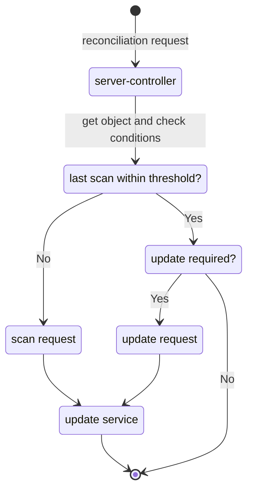
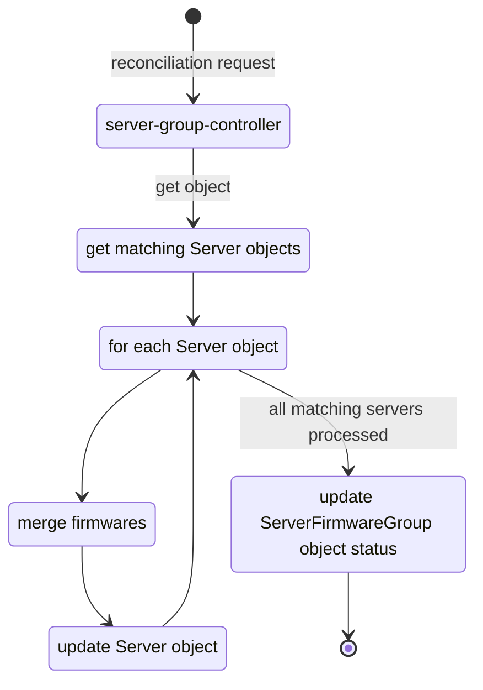
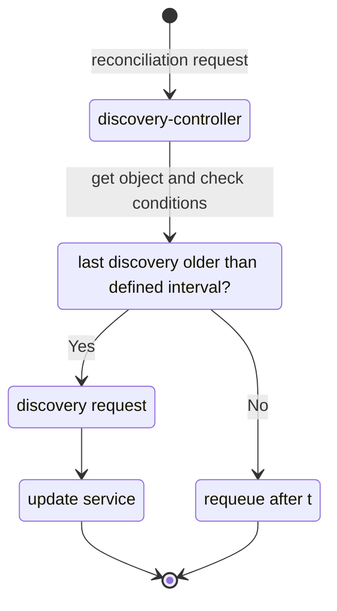
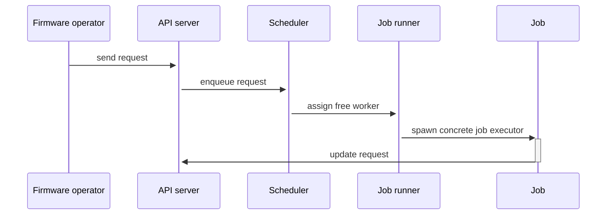

# Server BIOS/Firmware update

Linked issue: [#99 BIOS/Firmware Update](https://github.com/ironcore-dev/metal-operator/issues/99)

## Table of contents

1. [Introduction](#introduction)
   1. [Requirements](#requirements)
   2. [Terminology](#terminology)
   3. [Design goals](#design-goals)
2. [Problem statement](#problem-statement)
3. [Solution](#solution)
   1. [Custom resources](#custom-resources)
      1. [ServerFirmware](#serverfirmware)
      2. [ServerFirmwareGroup](#serverfirmwaregroup)
      3. [DiscoveredFirmware](#discoveredfirmware)
   2. [Firmware operator](#firmware-operator)
      1. [server-controller](#server-controller)
      2. [server-group-controller](#server-group-controller)
      3. [discovery-controller](#discovery-controller)
   3. [Update service](#update-service)
      1. [API server](#api-server)
      2. [Scheduler](#scheduler)
      3. [Job runner](#job-runner)
      4. [Update/scan/discovery job](#updatescandiscovery-job)
      5. [Components' communication diagram](#components-communication-diagram)

## Introduction

### Requirements

Throughout this document, the words are used to define and the significance of particular requirements is capitalized:

- `MUST` or `REQUIRED` means that the item is mandatory requirement;
- `MUST NOT` means that the item is an absolute prohibition;
- `SHOULD` or `RECOMMENDED` means that there may exist valid reasons in particular circumstances for not complying
  with an item;
- `SHOULD NOT` means that there may exist valid reasons in particular circumstances when listed behavior is acceptable;
- `MAY` or `OPTIONAL` means that the item is truly optional;

### Terminology

- `firmware operator`: the application running as a workload in Kubernetes cluster, interacting with Kubernetes API. It
  reconciles custom resources (hereafter CR) related to servers' firmware update workflow;
- `update service`: the application running as a workload in Kubernetes cluster, providing API to schedule update
  jobs, execute these jobs, collect jobs' results and update corresponding Kubernetes objects;
- `update job`: the execution item, which runs concrete implementation of the BIOS/firmware update routine on target
  hardware server;
- `scan job`: the execution item, which runs concrete implementation for scanning of the firmware installed on
  target hardware server;
- `discovery job`: discovering of the BIOS/firmware versions available for download or installation.
  Vendor-specific as an `update job`;
- `update strategy`: the path chosen to apply updates, e.g.: pre-built boot image with updates, docker image with
  baked updates, vendor-specific CLI tool, etc.

### Design goals

The following list gives general design goals for BIOS/Firmware updates:

- the solution SHOULD be vendor-agnostic aside from concrete update job implementation;
- the solution SHOULD allow automated hardware servers' firmware lifecycle maintaining;
- the solution MUST be extensible by the possibility of using plugins for update strategy;
- the solution MUST be extensible by the possibility of adding vendor-specific update jobs;
- the solution SHOULD be as kubernetes-native as possible;

## Problem statement

It is necessary to provide a robust, reliable and scalable solution to automate servers' firmware updating process.
Aside from that, it SHOULD also be as much kubernetes-native as possible.
It SHOULD provide a clear and concise API.
It SHOULD provide the ability to automate the update process along with the ability to override common settings in
particular circumstances for particular servers.

## Solution

The following is a concept of a solution aimed to solve listed problems in regard to hardware servers'
BIOS/Firmware updates.
The following sections guide through:

- Kubernetes API types, which represent servers' firmware state;
- Kubernetes operator, which reconciles these API types;
- Dedicated service, which provides API to schedule and execute firmware updates on specified servers;
- Communication between operator and update service;

### Custom resources

The following CRs aimed to represent the current state of a particular server, a desired state of a
group of servers and available firmware versions for a particular manufacturer-model:

- ServerFirmware
- ServerFirmwareGroup
- DiscoveredFirmware

All the following CRs MUST be cluster-scoped.
The firmware versions defined for concrete `ServerFirmware` object MUST take precedence over those provided by
corresponding `ServerFirmwareGroup` object.

#### ServerFirmware

`ServerFirmware` CR represents the desired state of concrete hardware server.
The `.spec` of this type references the `Server` object, reflects its `.status.bios` field and contains the list of
firmwares desired to be installed.
The `.status` of this type contains information about the BIOS/firmware versions which are actually installed on the
server.
Aside from that `.spec` contains the scan threshold and the `.status` contains last scan operation timestamp.
These two fields allow calculating whether the scanning for installed firmware is required or not.
The `ServerFirmware` object SHOULD be created along with corresponding `Server` object and MUST be unique across
the cluster.

```yaml
apiVersion: metal.ironcore.dev/v1alpha1
kind: ServerFirmware
metadata:
  name: foo
spec:
  scanThreshold: 30m
  serverRef:
    name: foo
  bios:
    version: 1.0.0
  firmwares:
    - name: ssd
      manufacturer: ACME Corp.
      version: 1.0.0
    - name: nic
      manufacturer: Intel
      version: 2.0.0
status:
  lastScanTime: 01-01-2001 01:00:00
  bios:
    version: 1.0.0
  firmwares:
    - name: ssd
      manufacturer: ACME Corp.
      version: 1.0.0
    - name: nic
      manufacturer: Intel
      version: 2.0.0
```

#### ServerFirmwareGroup

`ServerFirmwareGroup` CR represents the groups of hardware servers and their desired firmware versions.
The group of servers MUST be manufacturer- and model-specific to ensure that defined firmware will be applicable.
The `.spec` of this type contains built-in label selector and the list of firmwares desired to be installed.
The `.status` of this type contains the information about number of servers within the defined group which are in
desired state.
The group MUST have a unique selector and selectors in different `ServerFirmwareGroup` objects MUST NOT intersect.

```yaml
apiVersion: metal.ironcore.dev/v1alpha1
kind: ServerFirmwareGroup
metadata:
  name: bar-group
spec:
  manufacturer: Lenovo
  model: 7x21
  serverSelector:
    matchLabels:
      env: prod
  firmwares:
    - name: ssd
      manufacturer: ACME Corp.
      version: 1.0.0
    - name: nic
      manufacturer: Intel
      version: 2.0.0
status:
  serversInGroup: 4
  updatesApplied: 3
  updatesNotApplied: 1
```

#### DiscoveredFirmware

`DiscoveredFirmware` CR represents discovered firmware versions for a specific manufacturer-model.
The `.spec` of this type contains information about manufacture, concrete model,the desired number of versions to
store and the interval between each firmware version discovery run.
The `.status` of this type contains the list of firmwares and the last discovery job run time.
Each entry represents the name of individual firmware and the list of available versions.
The maximum length of this list MUST NOT exceed one defined in `.spec`.
The `DiscoveredFirmware` object SHOULD be created as soon as a new manufacturer-model pair is found and MUST be
unique across the cluster.

```yaml
apiVersion: metal.ironcore.dev/v1alpha1
kind: DiscoveredFirmware
metadata:
  name: baz
spec:
  manufacturer: Lenovo
  model: 7x21
  discoveryInterval: 24h
  versionsToStore: 3
status:
  lastDiscoveryTime: 01-01-2001 01:00:00
  bios:
    versions: [1.0.0]
  firmwares:
    - name: ssd
      manufacturer: ACME Corp.
      version: [1.0.0, 1.1.0, 1.2.0]
    - name: nic
      manufacturer: Intel
      version: [1.5.0, 1.7.0, 2.0.0]
```

### Firmware operator

This is an application that watches and reconciles CRs listed in the previous section.
It consists of the following controllers:

- server-controller (reconciles `ServerFirmware` CR)
- server-group-controller (reconciles `ServerFirmwareGroup` CR)
- discovery-controller (reconciles `DiscoveredFirmware` CR)

The `server-controller` and `discovery-controller` interacts with update service, whilst `server-group-controller`
only updates CRs.

#### server-controller

This controller reconciles `ServerFirmware` CR.
When an object of this kind is being reconciled, the controller MUST send a scan request to the update
service in case `.status.lastScanTime` exceeds the `.spec.scanThreshold`.
After the object becomes updated with actually installed firmware versions, the controller computes the difference
between desired state defined in object's `.spec` and actual state reflected in object's `.status`.
If there is discrepancy between these two states, then `server-controller` MUST send an update request to the update
service.
After sending any of the mentioned requests, it MUST stop reconciliation by returning an empty result and nil
error in case the request was successful and an error otherwise.



#### server-group-controller

This controller reconciles `ServerFirmwareGroup` CR.
When an object of this kind is being reconciled, the controller:

1. MUST discover all `ServerFirmware` objects that matches the defined label selector;
2. for each discovered object it MUST merge `.spec.firmwares` considering that items defined in `ServerFirmware`
   object's spec take precedence over those defined in `ServerFirmwareGroup` object's spec;
3. MUST update `ServerFirmware` object's `.spec.firmwares` field with a resulting list of firmware versions;
4. SHOULD update object's `.status` with actual values;



#### discovery-controller

This controller reconciles `DiscoveredFirmware` CR.
It MUST send discovery request to the update service to enqueue a firmware discovery job if `.status.
lastDiscoveryTime` is older than `.spec.discoveryInterval`.
After sending the request, it MUST stop reconciliation by returning an empty result and nil error in case the
request was successful and an error otherwise.



### Update service

This is an application providing an API to schedule, execute and collect results of firmware update, discover and
scan jobs.
It consists of the following components:

- API server
- scheduler
- job runner

Update service MUST be extensible in part of the possibility of using plugins for update strategy.
At the same time, the only update strategy can be enabled for a particular update service instance.
Update service MAY also include the component to download and store the firmwares.

#### API server

API server exposes update service endpoints and forwards incoming requests to the scheduler.
It MUST expose the following endpoints:

- Update(UpdateRequest) UpdateResponse;
  `UpdateRequest` MUST contain the reference to concrete `Server` object and the list of the firmware-version to be
  installed.
  `UpdateResponse` MUST contain the status of the request with error code if any.
- Scan(ScanRequest) ScanResponse;
  `ScanRequest` MUST contain the reference to concrete `Server` object.
  `ScanResponse` MUST contain the status of the request with error code if any.
- Discover(DiscoverRequest) DiscoverResponse;
  `DiscoverRequest` MUST contain the reference to concrete `DiscoveredFirmware` object.
  `DiscoverResponse` MUST contain the status of the request with error code if any.
- UpdateServer(UpdateServerRequest) UpdateServerResponse;
  `UpdateServerRequest` MUST contain the reference to concrete `Server` object and the list of installed
  firmware-versions.
  This endpoint MUST be used by update or scan jobs after a task if finished to send results and invoke the
  object's update.
  `UpdateServerResponse` MUST contain the status of the request with error code if any.
- UpdateDiscoveredFirmware(UpdateDiscoveredFirmwareRequest) UpdateDiscoveredFirmwareResponse;
  `UpdateDiscoveredFirmwareRequest` MUST contain the reference to concrete `DiscoveredFirmware` object and the
  list of discovered firmware-versions.
  This endpoint MUST be used by discovery jobs after a task is finished to send results and invoke the object's update.
  `UpdateDiscoveredFirmwareResponse` MUST contain the status of the request with error code if any.

Depending on the type of the request, it SHOULD be forwarded to the corresponding scheduler's queue.

#### Scheduler

Scheduler is a component of the update service that is responsible for scheduling jobs:

- it MUST NOT allow running several jobs on the same target server simultaneously;
- it MAY discard incoming update or scan requests if the same jobs targeting the same server are already scheduled;
- it MAY discard incoming discovery requests if the job targeting the same manufacturer-model pair is already scheduled;
- it MUST have a mechanism to limit the number of parallel jobs;
- it MUST have a mechanism to limit the job queue length;

Scheduler SHOULD have an embedded job runner component corresponding to the update strategy defined on the update
service application start.

#### Job runner

Job runner is a component that acts as a pool to spawn worker for a concrete job, considering the chosen update
strategy and target server's manufacturer and model pair.

- it MUST have a mechanism to store the metadata of spawned jobs;
- it MUST have a mechanism to interrupt a running job;
- it MAY have a mechanism to request the state of a long-running task;

#### Update/scan/discovery job

Standalone application which is a concrete implementation of firmware update/scan/discovery for a particular
manufacturer or manufacturer-model pair.
Implementation depends on the chosen update strategy.
The application MUST run an API server providing the following endpoints:

- CancelTask(CancelTaskRequest) CancelTaskResponse;
  `CancelTaskRequest` MAY contain the timeout for graceful stop and a flag to force stop.
  `CancelTaskResponse` MUST contain the status of the request with error code if any.

Discovery job MAY provide additional functionality to download firmware from manufacturer's servers and to upload it
to the local storage.
Local in this context does not refer to the local filesystem but rather to storage running and available from within
the infrastructure.

Job MUST include an embedded client to be able to interact with the API server using endpoints:

- UpdateServer(UpdateServerRequest) UpdateServerResponse;
- UpdateDiscoveredFirmware(UpdateDiscoveredFirmwareRequest) UpdateDiscoveredFirmwareResponse;

#### Components' communication diagram


