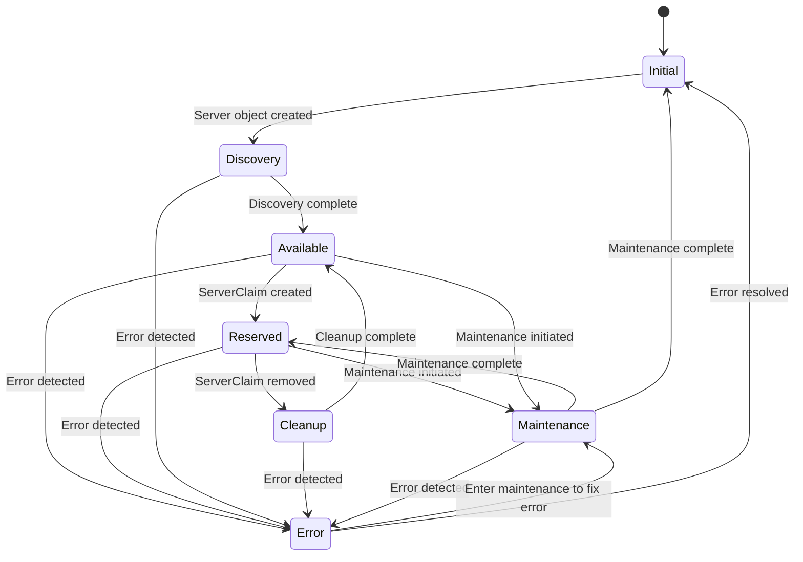

# Servers

The `Server` Custom Resource Definition (CRD) represents a bare metal server. It manages the state and lifecycle of 
physical servers, enabling automated hardware management tasks such as power control, BIOS configuration, and 
firmware updates. Interaction with a `Server` resource is facilitated through its associated Baseboard Management 
Controller (BMC), either by referencing a [`BMC`](bmcs.md) resource or by providing direct BMC configuration.

## Example Server Resource

```yaml
apiVersion: metal.ironcore.dev/v1alpha1
kind: Server
metadata:
  name: my-server
spec:
  uuid: "123e4567-e89b-12d3-a456-426614174000"
  power: "Off"
  bmcRef:
    name: my-bmc
  bootOrder:
    - name: PXE
      priority: 1
      device: Network
  BIOS:
    - version: "1.0.3"
      settings:
        BootMode: UEFI
        Virtualization: Enabled
```

## Usage

The `Server` CRD is central to managing bare metal servers. It allows for:

- **Power Management**: Powering servers on and off.
- **BIOS Configuration**: Changing BIOS settings and performing BIOS updates.
- **Lifecycle Management**: Handling the server's lifecycle through various states.
- **Hardware Discovery**: Gathering hardware information via BMC and in-band agents.

## Lifecycle and States

A server undergoes the following phases:

1. **Initial**: The server object is created; hardware details are not yet known.

2. **Discovery**:
    - The `ServerReconciler` interacts with the BMC to retrieve hardware details.
    - An initial boot is performed using a predefined ignition configuration.
    - An agent called [`metalprobe`](https://github.com/ironcore-dev/metal-operator/tree/main/cmd/metalprobe) runs on the server to collect additional data (e.g., network interfaces, disks).
    - The collected data is reported back to the `metal-operator` and added to the `ServerStatus`.`

3. **Available**: The server has completed discovery and is ready for use.

4. **Reserved**:
    - A [`ServerClaim`](serverclaims.md) resource is created to claim the server.
    - The server transitions to the `Reserved` state.
    - The server is allocated for a specific use or user.

5. **Cleanup**:
    - When the [`ServerClaim`](serverclaims.md) is removed, the server enters the Cleanup state.
    - Sanitization processes are performed (e.g., wiping disks, resetting BIOS settings).
      
6. **Maintenance**:
    - Servers in the `Available` state can transition to `Maintenance`.
    - Maintenance tasks such as BIOS updates or hardware repairs are performed.

7. **Error**:
    - The server has encountered an error.
    - Requires intervention to resolve issues before it can return to `Available`.

The state diagram below represents the various server states and their transitions:



## Interaction with BMC

Interaction with a server is done through its BMC:

Via Reference: Reference a [`BMC`](bmcs.md) resource using `bmcRef`.

```yaml
apiVersion: metal.ironcore.dev/v1alpha1
kind: Server
metadata:
  name: server-with-bmc-ref
spec:
  uuid: "123e4567-e89b-12d3-a456-426614174000"
  power: "On"
  bmcRef:
    name: my-bmc
  bootOrder:
    - name: PXE
      priority: 1
      device: Network
  BIOS:
    - version: "1.0.3"
      settings:
        BootMode: UEFI
        HyperThreading: Enabled
```

Inline Configuration: Use the `bmc` field to provide direct BMC access details.

```yaml
apiVersion: v1alpha1
kind: BMC
metadata:
  name: my-bmc
spec:
  endpointRef:
    name: my-bmc-endpoint
  bmcSecretRef:
    name: my-bmc-secret
  protocol:
    name: Redfish
    port: 8000
  consoleProtocol:
    name: SSH
    port: 22
```
