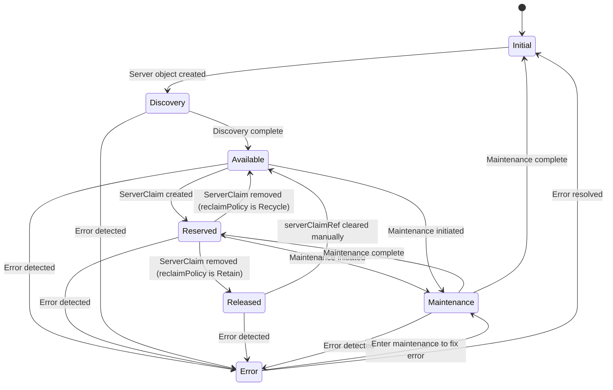

# Servers

The `Server` Custom Resource Definition (CRD) represents a bare metal server. It manages the state and lifecycle of 
physical servers, enabling automated hardware management tasks such as power control, BIOS configuration, and 
firmware updates. Interaction with a `Server` resource is facilitated through its associated Baseboard Management 
Controller (BMC), either by referencing a [`BMC`](bmcs.md) resource or by providing direct BMC configuration.

## Example Server Resource

```yaml
apiVersion: metal.ironcore.dev/v1alpha1
kind: Server
metadata:
  name: my-server
spec:
  systemUUID: "123e4567-e89b-12d3-a456-426614174000"
  power: "Off"
  reclaimPolicy: Recycle
  bmcRef:
    name: my-bmc
  bootOrder:
    - name: PXE
      priority: 1
      device: Network
  BIOS:
    - version: "1.0.3"
      settings:
        BootMode: UEFI
        Virtualization: Enabled
```

## Usage

The `Server` CRD is central to managing bare metal servers. It allows for:

- **Power Management**: Powering servers on and off.
- **BIOS Configuration**: Changing BIOS settings and performing BIOS updates.
- **Lifecycle Management**: Handling the server's lifecycle through various states.
- **Hardware Discovery**: Gathering hardware information via BMC and in-band agents.

## Lifecycle and States

A server undergoes the following phases:

1. **Initial**: The server object is created; hardware details are not yet known.

2. **Discovery**:
    - The `ServerReconciler` interacts with the BMC to retrieve hardware details.
    - An initial boot is performed using a predefined ignition configuration.
    - An agent called [`metalprobe`](https://github.com/ironcore-dev/metal-operator/tree/main/cmd/metalprobe) runs on the server to collect additional data (e.g., network interfaces, disks).
    - The collected data is reported back to the `metal-operator` and added to the `ServerStatus`.`

3. **Available**: The server has completed discovery and is ready for use.

4. **Reserved**:
    - A [`ServerClaim`](serverclaims.md) resource is created to claim the server.
    - The server transitions to the `Reserved` state.
    - The server is allocated for a specific use or user.

5. **Released**:
    - Only entered when `spec.reclaimPolicy` is `Retain` and the [`ServerClaim`](serverclaims.md) has been deleted.
    - The server is powered off and its `BootConfigurationRef` is cleared, but `spec.serverClaimRef` is kept.
    - The server stays in `Released` until an operator manually clears `spec.serverClaimRef`, at which point it transitions back to `Available`.
    - See [Reclaim Policy](#reclaim-policy) below.

6. **Maintenance**:
    - Servers in the `Available` state can transition to `Maintenance`.
    - Maintenance tasks such as BIOS updates or hardware repairs are performed.

7. **Error**:
    - The server has encountered an error.
    - Requires intervention to resolve issues before it can return to `Available`.

The state diagram below represents the various server states and their transitions:


```mermaid
stateDiagram-v2
    [*] --> Initial
    Initial --> Discovery : Server object created
    Discovery --> Available : Discovery complete
    Available --> Reserved : ServerClaim created
    Reserved --> Maintenance : Maintenance initiated
    Maintenance --> Reserved : Maintenance complete
    Reserved --> Available : ServerClaim removed (reclaimPolicy is Recycle)
    Reserved --> Released : ServerClaim removed (reclaimPolicy is Retain)
    Released --> Available : serverClaimRef cleared manually
    Available --> Maintenance : Maintenance initiated
    Maintenance --> Initial : Maintenance complete
    Available --> Error : Error detected
    Reserved --> Error : Error detected
    Discovery --> Error : Error detected
    Released --> Error : Error detected
    Maintenance --> Error : Error detected
    Error --> Maintenance : Enter maintenance to fix error
    Error --> Initial : Error resolved
```

## Reclaim Policy

The `spec.reclaimPolicy` field controls what happens to a `Server` when its bound [`ServerClaim`](serverclaims.md) is deleted. Two values are supported, with `Recycle` as the default:

| Value     | Behavior |
|-----------|----------|
| `Recycle` | When the claim is gone, the server is powered off, its `BootConfigurationRef` is cleared, `spec.serverClaimRef` is removed, and the server transitions directly back to `Available` so that it can be claimed again. |
| `Retain`  | When the claim is gone, the server is powered off and its `BootConfigurationRef` is cleared, but `spec.serverClaimRef` is **not** removed. The server transitions to the `Released` state and remains there until an operator manually clears `spec.serverClaimRef`. Once cleared, the server transitions back to `Available`. |

`Retain` is useful when human inspection is required between uses: for example, to forensically investigate a workload, audit disks, or run an out-of-band sanitization step before the server re-enters the pool. `Recycle` is the right choice for general-purpose pools where servers should be returned to `Available` automatically.

Example using `Retain`:

```yaml
apiVersion: metal.ironcore.dev/v1alpha1
kind: Server
metadata:
  name: my-server
spec:
  systemUUID: "123e4567-e89b-12d3-a456-426614174000"
  reclaimPolicy: Retain
  bmcRef:
    name: my-bmc
```

To return a `Released` server to the pool, remove the stale claim reference:

```bash
kubectl patch server my-server --type=merge -p '{"spec":{"serverClaimRef":null}}'
```

## Interaction with BMC

Interaction with a server is done through its BMC:

Via Reference: Reference a [`BMC`](bmcs.md) resource using `bmcRef`.

```yaml
apiVersion: metal.ironcore.dev/v1alpha1
kind: Server
metadata:
  name: server-with-bmc-ref
spec:
  systemUUID: "123e4567-e89b-12d3-a456-426614174000"
  power: "On"
  bmcRef:
    name: my-bmc
  bootOrder:
    - name: PXE
      priority: 1
      device: Network
  BIOS:
    - version: "1.0.3"
      settings:
        BootMode: UEFI
        HyperThreading: Enabled
```

Inline Configuration: Use the `bmc` field to provide direct BMC access details.

```yaml
apiVersion: v1alpha1
kind: BMC
metadata:
  name: my-bmc
spec:
  endpointRef:
    name: my-bmc-endpoint
  bmcSecretRef:
    name: my-bmc-secret
  protocol:
    name: Redfish
    port: 8000
  consoleProtocol:
    name: SSH
    port: 22
```
