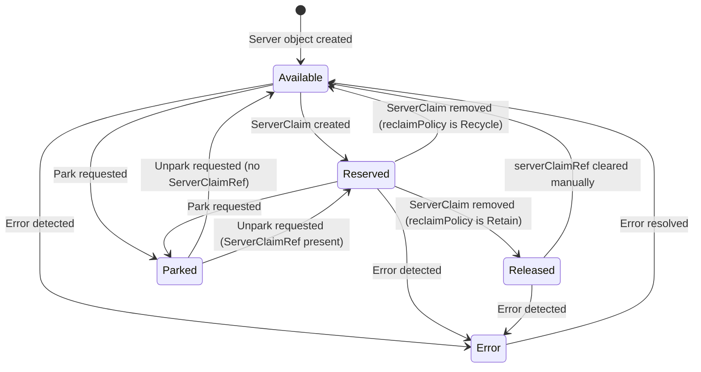

# Servers

The `Server` Custom Resource Definition (CRD) represents a bare metal server. It manages the state and lifecycle of 
physical servers, enabling automated hardware management tasks such as power control, BIOS configuration, and 
firmware updates. Interaction with a `Server` resource is facilitated through its associated Baseboard Management 
Controller (BMC), either by referencing a [`BMC`](bmcs.md) resource or by providing direct BMC configuration.

## Example Server Resource

```yaml
apiVersion: metal.ironcore.dev/v1alpha1
kind: Server
metadata:
  name: my-server
spec:
  systemUUID: "123e4567-e89b-12d3-a456-426614174000"
  reclaimPolicy: Recycle
  bmcRef:
    name: my-bmc
  bootOrder:
    - name: PXE
      priority: 1
      device: Network
```

Desired power for a workload is configured on the `ServerClaim` via [`spec.power`](serverclaims.md),
not on the `Server`.

## Usage

The `Server` CRD is central to managing bare metal servers. It allows for:

- **Power Management**: Powering servers on and off. Workload power is requested via the [`ServerClaim`](serverclaims.md),
  while lifecycle states drive power directly — on when reserved, off when available, released, or [parked](#parking).
- **BIOS Configuration**: Changing BIOS settings and performing BIOS updates.
- **Lifecycle Management**: Handling the server's lifecycle through various states.
- **Hardware Information**: Gathering hardware information via BMC.

## Lifecycle and States

A server undergoes the following phases:

1. **Available**: The server object is created and transitions directly to the `Available` state.
    - The `ServerReconciler` interacts with the BMC to retrieve hardware details (manufacturer, model, processors, storage) and adds them to the `ServerStatus`.
    - An idle server is powered off and ready for use.

2. **Reserved**:
    - A [`ServerClaim`](serverclaims.md) resource is created to claim the server.
    - The server transitions to the `Reserved` state.
    - The server is allocated for a specific use or user.

3. **Released**:
    - Only entered when `spec.reclaimPolicy` is `Retain` and the [`ServerClaim`](serverclaims.md) has been deleted.
    - The server is powered off and its `BootConfigurationRef` is cleared, but `spec.serverClaimRef` is kept.
    - The server stays in `Released` until an operator manually clears `spec.serverClaimRef`, at which point it transitions back to `Available`.
    - See [Reclaim Policy](#reclaim-policy) below.

4. **Parked**:
    - An overlay state a server enters when it is **parked** out of the `ServerClaim` lifecycle so an
      external component can run an out-of-band **day-2 operation** (a firmware or BIOS/BMC update,
      hardware rework, diagnostics, or low-level storage reconfiguration) that must not be fought by
      the reconcilers.
    - Entering the state powers the server **off**. While parked, both the `Server` and `ServerClaim`
      reconcilers stand down: no boot is performed and no power state is healed, so the external actor
      owns power control (e.g. the power cycles a firmware update needs). Boot behavior during the
      procedure is the external actor's responsibility: it must ensure a correct boot order so the box
      does not boot the claim's image.
    - Only servers in the `Available` or `Reserved` state can be parked. A park request on a server in
      any other state is deferred until it reaches a parkable state.
    - See [Parking](#parking) below.

5. **Error**:
    - The server has encountered an error.
    - Requires intervention to resolve issues before it can return to `Available`.

The state diagram below represents the various server states and their transitions:


```mermaid
stateDiagram-v2
    [*] --> Available : Server object created
    Available --> Reserved : ServerClaim created
    Reserved --> Available : ServerClaim removed (reclaimPolicy is Recycle)
    Reserved --> Released : ServerClaim removed (reclaimPolicy is Retain)
    Released --> Available : serverClaimRef cleared manually
    Available --> Parked : Park requested
    Reserved --> Parked : Park requested
    Parked --> Available : Unpark requested (no ServerClaimRef)
    Parked --> Reserved : Unpark requested (ServerClaimRef present)
    Available --> Error : Error detected
    Reserved --> Error : Error detected
    Released --> Error : Error detected
    Error --> Available : Error resolved
```

## Reclaim Policy

The `spec.reclaimPolicy` field controls what happens to a `Server` when its bound [`ServerClaim`](serverclaims.md) is deleted. Two values are supported, with `Recycle` as the default:

| Value     | Behavior |
|-----------|----------|
| `Recycle` | When the claim is gone, the server is powered off, its `BootConfigurationRef` is cleared, `spec.serverClaimRef` is removed, and the server transitions directly back to `Available` so that it can be claimed again. |
| `Retain`  | When the claim is gone, the server is powered off and its `BootConfigurationRef` is cleared, but `spec.serverClaimRef` is **not** removed. The server transitions to the `Released` state and remains there until an operator manually clears `spec.serverClaimRef`. Once cleared, the server transitions back to `Available`. |

`Retain` is useful when human inspection is required between uses: for example, to forensically investigate a workload, audit disks, or run an out-of-band sanitization step before the server re-enters the pool. `Recycle` is the right choice for general-purpose pools where servers should be returned to `Available` automatically.

Example using `Retain`:

```yaml
apiVersion: metal.ironcore.dev/v1alpha1
kind: Server
metadata:
  name: my-server
spec:
  systemUUID: "123e4567-e89b-12d3-a456-426614174000"
  reclaimPolicy: Retain
  bmcRef:
    name: my-bmc
```

To return a `Released` server to the pool, remove the stale claim reference:

```bash
kubectl patch server my-server --type=merge -p '{"spec":{"serverClaimRef":null}}'
```

## Cordoning

`spec.unclaimable` is a first-class, typed **cordon** signal on a `Server`. When set to `true`, it prevents **new** [`ServerClaim`](serverclaims.md)s from binding to the server. Already-bound claims are unaffected: the existing `spec.serverClaimRef` stays in place while the server is cordoned.

Cordon is orthogonal to the `Available → Reserved` state machine: it affects claimability, not phase progression. A server may be cordoned in any state; a cordoned server in `Available` simply will not be picked up by new claims until it is uncordoned.

- A claim with an explicit `serverRef` to a cordoned server stays `Pending` (its phase remains `Unbound`).
- A claim using a `serverSelector` skips cordoned candidates. If no uncordoned candidate matches, the claim stays `Pending`.
- Toggling `spec.unclaimable` back to `false` automatically re-triggers binding for any pending claims targeting the server.

```yaml
apiVersion: metal.ironcore.dev/v1alpha1
kind: Server
metadata:
  name: my-server
spec:
  systemUUID: "123e4567-e89b-12d3-a456-426614174000"
  unclaimable: true
  bmcRef:
    name: my-bmc
```

Cordon a server for manual maintenance using [`metalctl`](../usage/metalctl.md#cordon):

```bash
metalctl cordon my-server
```

Uncordon a server to return it to the claimable pool:

```bash
metalctl uncordon my-server
```

Both commands accept `--kubeconfig`/`--context` to select the target cluster and `--dry-run` to preview the patch
without applying it. See the [`metalctl` documentation](../usage/metalctl.md#cordon) for details.

If `metalctl` is not available, `spec.unclaimable` is a plain spec field and can be toggled directly with
`kubectl patch` as a fallback:

```bash
# Cordon
kubectl patch server my-server --type=merge -p '{"spec":{"unclaimable":true}}'

# Uncordon
kubectl patch server my-server --type=merge -p '{"spec":{"unclaimable":false}}'
```

Any subject with `update` permission on the `Server` resource can toggle `spec.unclaimable`, typically operators/admins for manual maintenance and automated maintenance controllers.

## Third-party discovery and initialization gating

A `Server` becomes `Available` directly on creation. Since there is no built-in "not yet discovered" lifecycle stage, an external component (inventory sync, CMDB importer, discovery controller) that creates `Server` objects must express pending initialization work explicitly instead: with **taints** (a `NoBind` taint prevents any `ServerClaim` from binding) and **conditions** on the server status.

Metal-operator defines neither the taint keys nor the condition types. Both belong to the third party. The following keys (`Undiscovered`, `Uninitialized`, `Discovered`, `Initialized`) are examples chosen by the third-party controller.

A server that first needs a discovery boot and afterward a one-time BMC/BIOS baseline configuration is created with both taints:

```yaml
apiVersion: metal.ironcore.dev/v1alpha1
kind: Server
metadata:
  name: node-0
  labels:
    metal.ironcore.dev/managed-by: my-discovery-controller
spec:
  systemUUID: "4c4c4544-0056-4d10-8058-b1c04f5a0333"
  bmc:
    protocol:
      name: Redfish
      port: 443
    address: 192.168.1.10
    bmcSecretRef:
      name: node-0-bmc-credentials
  taints:
    - key: metal.ironcore.dev/Undiscovered
      effect: NoBind
    - key: metal.ironcore.dev/Uninitialized
      effect: NoBind
```

The server is `Available` per the state machine, but no `ServerClaim` can bind while the taints are present. The third party then works through its gates:

1. **Discovery boot.** The third party drives the first boot into the introspection image, either directly through the BMC access it owns or through metal-operator, by creating a `ServerClaim` that tolerates its own gating taint:

```yaml
apiVersion: metal.ironcore.dev/v1alpha1
kind: ServerClaim
metadata:
  name: node-0-discovery
spec:
  serverRef:
    name: node-0
  power: "On"
  image: discovery-agent:latest
  ignitionSecretRef:
    name: node-0-discovery-ignition
  tolerations:
    - key: metal.ironcore.dev/Undiscovered
      operator: Exists
      effect: NoBind
```

   The tainted server binds to this claim and powers on with the discovery image. Regular claims still cannot bind. When the in-band agent has reported back, the third party stores the extracted hardware details in its own backend, sets the condition `Discovered: True` on the `Server` status, and deletes the discovery claim.

2. **Initialization.** The third party performs one-time setup through the BMC access it owns (firmware/BIOS baseline, accounts, network) and afterwards sets the condition `Initialized: True` on the `Server` status.

3. **Taint removal.** One `ServerReadinessRule` per gate removes the matching taint once the corresponding condition appears:

```yaml
apiVersion: metal.ironcore.dev/v1alpha1
kind: ServerReadinessRule
metadata:
  name: undiscovered-gate
spec:
  serverSelector:
    matchLabels:
      metal.ironcore.dev/managed-by: my-discovery-controller
  conditions:
    - type: Discovered
      requiredStatus: "True"
  enforcementMode: BootstrapOnly
  taint:
    key: metal.ironcore.dev/Undiscovered
    effect: NoBind
---
apiVersion: metal.ironcore.dev/v1alpha1
kind: ServerReadinessRule
metadata:
  name: uninitialized-gate
spec:
  serverSelector:
    matchLabels:
      metal.ironcore.dev/managed-by: my-discovery-controller
  conditions:
    - type: Initialized
      requiredStatus: "True"
  enforcementMode: BootstrapOnly
  taint:
    key: metal.ironcore.dev/Uninitialized
    effect: NoBind
```

Once both taints are gone, the server is claimable by regular workloads. `BootstrapOnly` fits one-time gates like the ones above, since each gate is evaluated only until the taint is removed once. `Continuous` re-enforces the taint if the condition disappears again. Multiple gates compose freely: one taint per initialization stage and one rule per taint, all evaluated independently.

## Parking

Parking takes a `Server` out of the `ServerClaim` lifecycle so an external component can run an
out-of-band **day-2 operation**, a firmware or BIOS/BMC update, hardware rework, diagnostics, or
low-level storage reconfiguration, without the reconcilers interfering. Parking is what powers the
server down: as part of reaching the `Parked` state the operator powers the server **off** itself,
then stands down so an external component can perform the procedure. While a server is parked, both
the `Server` and `ServerClaim` reconcilers stand down: no boot is performed and no power state is
healed, so an intermediate restart during the procedure cannot boot the claim's image. The bound
`ServerClaim` stays in place (bound), so on recovery the claim controller can take over again
without re-scheduling.

Parking is driven by annotations with distinct roles:

- `metal.ironcore.dev/operation: park`: a **transient request** set by the external actor. The
  `Server` reconciler removes it again as soon as the server has reached the `Parked` state.
- `metal.ironcore.dev/operation: unpark`: a **transient request** set by the external actor to end
  parking. The `Server` reconciler removes it once the server has left the `Parked` state; while
  the annotation is present, the unpark is still in progress.
- `metal.ironcore.dev/parked: "true"`: a **durable, controller-set marker** the operator writes
  when it parks the server and removes again when an unpark request comes in. Do not set or remove
  it directly; it is controller-owned state, not user-facing input.

The `operation: park`/`unpark` request annotations are the interface of the current `Server`
reconciler implementation only. Eventually, the parking request is expected to originate from an
external entity rather than being issued by hand; the stand-down semantics of the `Parked` state
and the parked marker stay the same regardless of how the request arrives.

### Lifecycle

1. **Request.** The external actor sets the `operation` annotation to `park`:

   ```yaml
   metadata:
     annotations:
       metal.ironcore.dev/operation: park
   ```

   This is a one-shot request; it does **not** itself persist the parked state.
2. **Park.** The `Server` reconciler observes the request and, if the server is in a parkable state
   (`Available` or `Reserved`):
   - powers the server **off** via the BMC (idempotent; only if not already off),
   - records the parked state by setting the internal `metal.ironcore.dev/parked: "true"` annotation,
   - sets `status.state = Parked`,
   - **removes** the `metal.ironcore.dev/operation: park` request annotation again.
3. **Stand down.** While the `metal.ironcore.dev/parked` annotation is present:
   - the `Server` reconciler returns early, before any power healing, boot, or state-machine
     progression,
   - the `ServerClaim` reconciler returns early, so the claim does not re-apply the boot
     configuration or revert power. The `ServerClaim` stays bound; its phase is unchanged.
   - If `status.state` is ever lost or reset, the reconcilers reconstruct the parked status from the
     annotation and keep standing down.
4. **Resume.** The external actor brings the server back by setting the `operation` annotation to
   `unpark`:

   ```yaml
   metadata:
     annotations:
       metal.ironcore.dev/operation: unpark
   ```

   The `Server` reconciler processes the request step by step: it removes the internal
   `metal.ironcore.dev/parked` annotation, resumes the server, and only then removes the
   `operation: unpark` request annotation. The next reconciliation re-enters the normal flow:
   - the `Server` reconciler refreshes system info (hardware or firmware state may have changed
     during the procedure),
   - transitions back to the pre-parking state: `Reserved` if the server has a `ServerClaimRef`,
     otherwise `Available`,
   - the `ServerClaim` reconciler takes over again and re-applies the boot configuration, and the
     server state machine re-applies the claim's requested power state as before.

   An unpark request on a server that is not parked is a no-op: the request annotation is consumed
   and nothing else happens.

### Admission control

Parking is admitted only from the `Available` and `Reserved` states, the in-use states. A `park`
request on a server in any other state (`Released`, `Error`)
is **deferred**: the request annotation is left in place and retried on the next resync, so a server
that is still discovering (or otherwise not yet parkable) is parked automatically once it reaches a
parkable state, without the requestor having to re-issue the request.

### Interaction with deletion

The `parked` annotation does **not** gate the deletion path. A `Server` that is deleted while parked
is still cleaned up normally: the finalizer is removed and the boot configuration deleted. Parking and
deletion are independent.

### Example

Park a reserved server to run a firmware update out of band:

```bash
kubectl annotate server my-server metal.ironcore.dev/operation=park
```

Once the server has reached `Parked` (and the request annotation is consumed), perform the procedure.
When done, bring the server back with an unpark request:

```bash
kubectl annotate server my-server metal.ironcore.dev/operation=unpark
```

The bound `ServerClaim` resumes ownership without re-scheduling, and the server state machine reapplies the claim's requested power state, including `Off` when the claim requests it.

## Interaction with BMC

Interaction with a server is done through its BMC:

Via Reference: Reference a [`BMC`](bmcs.md) resource using `bmcRef`.

```yaml
apiVersion: metal.ironcore.dev/v1alpha1
kind: Server
metadata:
  name: server-with-bmc-ref
spec:
  systemUUID: "123e4567-e89b-12d3-a456-426614174000"
  bmcRef:
    name: my-bmc
  bootOrder:
    - name: PXE
      priority: 1
      device: Network
```

Inline Configuration: Use the `bmc` field to provide direct BMC access details on the
`Server` itself, without a separate `BMC` or `Endpoint` resource. The `bmcSecretRef` still
points to a [`BMCSecret`](bmcsecrets.md) that carries the credentials.

```yaml
apiVersion: metal.ironcore.dev/v1alpha1
kind: Server
metadata:
  name: server-with-inline-bmc
spec:
  systemUUID: "123e4567-e89b-12d3-a456-426614174000"
  bmc:
    protocol:
      name: Redfish
      port: 8000
    address: "192.168.100.10"
    bmcSecretRef:
      name: my-bmc-secret
```
