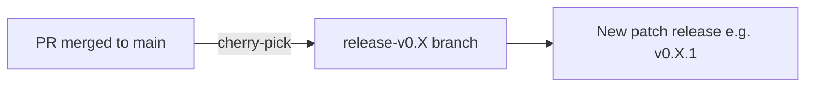

# Cherry-Picking PRs into Release Branches

This document describes how to cherry-pick a merged pull request into a release branch for patch releases.

## Prerequisites

- [gh CLI](https://cli.github.com/) installed and authenticated
- Clean git working tree

## Overview

When a bug fix or change needs to be included in an existing release (e.g. `v0.1.1`), the corresponding PR
that was merged into `main` can be cherry-picked into the appropriate release branch (e.g. `release-v0.1`).



## Using the cherry-pick script

A convenience script is provided at `hack/cherry-pick.sh`. It automates the entire process: creating a branch,
cherry-picking the merge commit, pushing, and opening a PR against the release branch.

```shell
./hack/cherry-pick.sh <PR-number> <release-branch>
```

### Example

Cherry-pick PR #123 into the `release-v0.1` branch:

```shell
./hack/cherry-pick.sh 123 release-v0.1
```

This will:

1. Fetch the merge commit of PR #123 from GitHub
2. Create a new branch `cherry-pick-123-into-release-v0.1` from `origin/release-v0.1`
3. Cherry-pick the merge commit
4. Push the branch and open a PR targeting `release-v0.1`

## Handling conflicts

If the cherry-pick results in merge conflicts, the script will stop and print instructions. To resolve:

1. Fix the conflicting files
2. Stage the resolved files with `git add`
3. Continue the cherry-pick:

    ```shell
    git cherry-pick --continue
    ```

4. Push and create the PR manually:

    ```shell
    git push origin cherry-pick-<PR>-into-<release-branch>
    gh pr create --base <release-branch> --title "🍒 [<release-branch>] <title>" --body "Cherry-pick of #<PR> into <release-branch>."
    ```

## Release notes

The [release-drafter](https://github.com/release-drafter/release-drafter) workflow automatically drafts release
notes for release branches. Once the cherry-pick PR is merged into the release branch, it will be included in the
next draft release for that branch.
