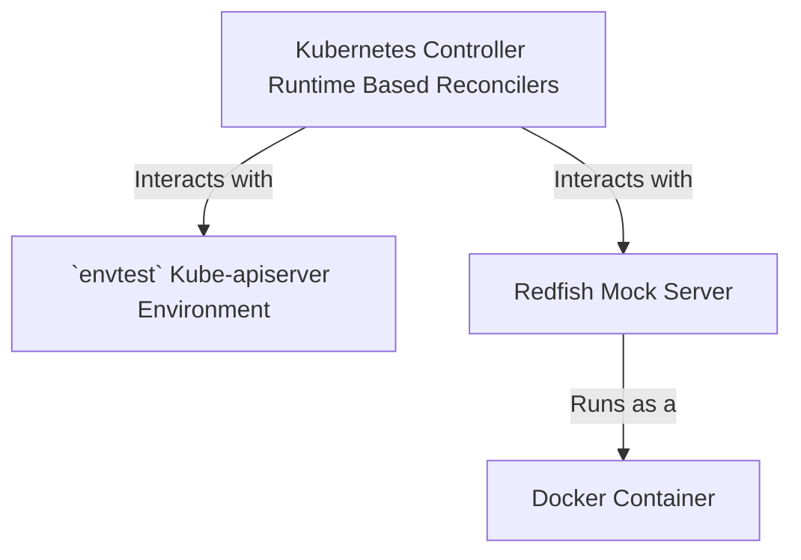

# Local Dev Setup

## Prerequisites

- go version v1.22.0+
- docker version 17.03+.
- kubectl version v1.11.3+.

## Overview

The `metal-operator` is leveraging [envtest](https://book.kubebuilder.io/reference/envtest.html) to conduct and run
unit test suites. Additionally, it is using the [Redfish Mock Server](https://github.com/DMTF/Redfish-Mockup-Server) to
run a local mock Redfish instance to simulate operations performed by various reconcilers.



### Run the local test suite

The local test suite can be run via 

```shell
make test
```

This `Makefile` directive will start under the hood the Redfish mock server, instantiate the `envtest` environment
and run `go test ./...` on the whole project.

### Start/Stop Redfish Mock Server

The Redfish mock server can be started and stopped with the following command

```shell
make startbmc
make stopbmc
```
