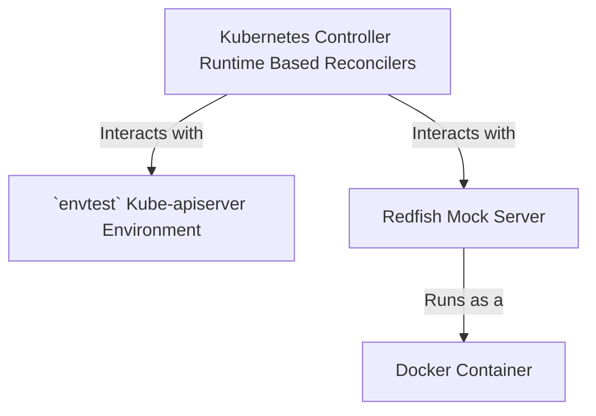

# Local Dev Setup

## Prerequisites

- go version v1.22.0+
- docker version 17.03+.
- kubectl version v1.28.0+.

## Overview

The `metal-operator` is leveraging [envtest](https://book.kubebuilder.io/reference/envtest.html) to conduct and run
unit test suites. Additionally, it is using the [Redfish Mock Server](https://github.com/DMTF/Redfish-Mockup-Server) to
run a local mock Redfish instance to simulate operations performed by various reconcilers.



### Run the local test suite

The local test suite can be run via 

```shell
make test
```

This `Makefile` directive will start under the hood the Redfish mock server, instantiate the `envtest` environment
and run `go test ./...` on the whole project.

### Start/Stop Redfish Mock Server

The Redfish mock server can be started and stopped with the following command

```shell
make startbmc
make stopbmc
```

### Run the local Tilt development environment

#### Prerequisites

- [Tilt v0.33.17+](https://docs.tilt.dev/install.html)
- [Kind v0.23.0+](https://kind.sigs.k8s.io/docs/user/quick-start/)

The local development environment can be started via

```shell
make tilt-up
```

This `Makefile` directive will:
- create a local Kind cluster with local registry
- install cert-manager
- install [boot-operator](https://github.com/ironcore-dev/boot-operator) to reconcile the `ServerBootConfiguration` CRD
- start the `metal-operator` controller and Redfish mock server as a sidecar container
- an Endpoint resource is created to point to the Redfish mock server
- this will result in `Server` resources being created and reconciled by the `metal-operator`

```shell
‹kind-metal› kubectl get server
NAME                            UUID                                   MANUFACTURER   POWERSTATE   STATE       AGE
compute-0-bmc-endpoint-sample   38947555-7742-3448-3784-823347823834   Contoso        On           Available   3m21s
```

The local development environment can be deleted via

```shell
make kind-delete
```
