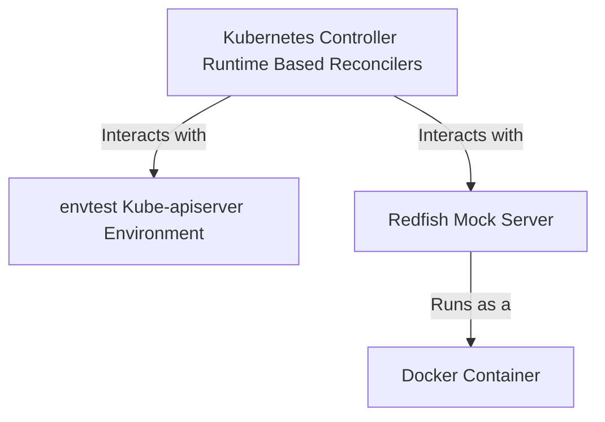

# Local Dev Setup

## Prerequisites

- go version v1.22.0+
- docker version 17.03+.
- kubectl version v1.28.0+.

## Overview

The `metal-operator` is leveraging [envtest](https://book.kubebuilder.io/reference/envtest.html) to conduct and run
unit test suites. Additionally, it is using the [Redfish Mock Server](https://github.com/DMTF/Redfish-Mockup-Server) to
run a local mock Redfish instance to simulate operations performed by various reconcilers.


```mermaid
graph TD
    A[Kubernetes Controller Runtime Based Reconcilers] -->|Interacts with| B[envtest Kube-apiserver Environment]
    A -->|Interacts with| C[Redfish Mock Server]
    C -->|Runs as a| D[Docker Container]
```

### Run the local test suite

The local test suite can be run via 

```shell
make test
```

This `Makefile` directive will start under the hood the Redfish mock server, instantiate the `envtest` environment
and run `go test ./...` on the whole project.

## Pre-Push Validation

When using Claude Code, automatic pre-push validation is configured to ensure code quality before pushing to GitHub. The validation runs these checks:

1. **Code Generation** (`make check-gen`) - Ensures generated code/manifests are up-to-date
2. **Linting** (`make lint`) - Runs golangci-lint
3. **License Headers** (`make check-license`) - Verifies SPDX headers
4. **Kustomize Validation** - Validates all kustomization.yaml files
5. **Unit Tests** (`make test`) - Runs the test suite

### Manual Validation

To run the same checks manually before pushing:

```shell
./hack/claude-pre-push-check.sh
```

Or run individual checks:

```shell
make check-gen          # Verify generated code is current
make lint               # Run linter
make check-license      # Verify license headers
./hack/validate-kustomize.sh  # Validate kustomize files
make test               # Run tests
```

Or use the comprehensive check target:

```shell
make check              # Runs all checks
```

### Emergency Bypass

In rare cases where you need to push without validation (not recommended):

```shell
CLAUDE_SKIP_PREPUSH=1 git push
```

**Warning:** Only use this for emergency hotfixes. CI will still run these checks and may fail.

### Disabling Pre-Push Hooks

If you prefer manual validation, you can disable the hook:

1. Edit `.claude/settings.local.json`
2. Remove or comment out the `PreToolUse` hook for git push
3. Remember to run `make check` before pushing manually

### Start/Stop Redfish Mock Server

The Redfish mock server can be started and stopped with the following command

```shell
make startbmc
make stopbmc
```

### Run the local Tilt development environment

#### Prerequisites

- [Tilt v0.33.17+](https://docs.tilt.dev/install.html)
- [Kind v0.23.0+](https://kind.sigs.k8s.io/docs/user/quick-start/)

The local development environment can be started via

```shell
make tilt-up
```

This `Makefile` directive will:
- create a local Kind cluster with local registry
- install cert-manager
- install [boot-operator](https://github.com/ironcore-dev/boot-operator) to reconcile the `ServerBootConfiguration` CRD
- start the `metal-operator` controller and Redfish mock server as a sidecar container
- an Endpoint resource is created to point to the Redfish mock server
- this will result in `Server` resources being created and reconciled by the `metal-operator`

```shell
‹kind-metal› kubectl get server
NAME                            SYSTEMUUID                             MANUFACTURER   POWERSTATE   STATE       AGE
compute-0-bmc-endpoint-sample   38947555-7742-3448-3784-823347823834   Contoso        On           Available   3m21s
```

The local development environment can be deleted via

```shell
make kind-delete
```
