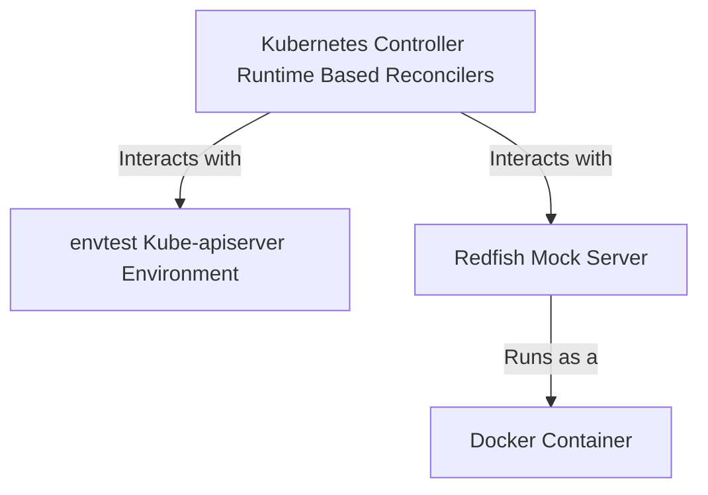

# Local Dev Setup

## Prerequisites

- go version v1.22.0+
- docker version 17.03+.
- kubectl version v1.28.0+.

## Overview

The `metal-operator` is leveraging [envtest](https://book.kubebuilder.io/reference/envtest.html) to conduct and run
unit test suites. Additionally, it is using the [Redfish Mock Server](https://github.com/DMTF/Redfish-Mockup-Server) to
run a local mock Redfish instance to simulate operations performed by various reconcilers.


```mermaid
graph TD
    A[Kubernetes Controller Runtime Based Reconcilers] -->|Interacts with| B[envtest Kube-apiserver Environment]
    A -->|Interacts with| C[Redfish Mock Server]
    C -->|Runs as a| D[Docker Container]
```

### Run the local test suite

The local test suite can be run via

```shell
make test
```

This `Makefile` directive will start under the hood the Redfish mock server, instantiate the `envtest` environment
and run `go test ./...` on the whole project.

### Start/Stop Redfish Mock Server

The Redfish mock server can be started and stopped with the following command

```shell
make startbmc
make stopbmc
```

### Run the local Tilt development environment

#### Prerequisites

- [Tilt v0.33.17+](https://docs.tilt.dev/install.html)
- [Kind v0.23.0+](https://kind.sigs.k8s.io/docs/user/quick-start/)

The local development environment can be started via

```shell
make tilt-up
```

This `Makefile` directive will:

- create a local Kind cluster with local registry
- install cert-manager
- install [boot-operator](https://github.com/ironcore-dev/boot-operator) to reconcile the `ServerBootConfiguration` CRD
- start the `metal-operator` controller and Redfish mock server as a sidecar container
- an Endpoint resource is created to point to the Redfish mock server
- this will result in `Server` resources being created and reconciled by the `metal-operator`

```shell
‹kind-metal› kubectl get server
NAME                            SYSTEMUUID                             MANUFACTURER   POWERSTATE   STATE       AGE
compute-0-bmc-endpoint-sample   38947555-7742-3448-3784-823347823834   Contoso        On           Available   3m21s
```

The local development environment can be deleted via

```shell
make kind-delete
```

### Connecting a Remote BMC in the Tilt Environment

By default, Tilt runs against a local Redfish mock server. To point the environment at real hardware instead, apply the following changes.

#### Prerequisites: Ensure the BMC is not actively managed

Before connecting a real BMC to your local Tilt environment, make sure it is not actively reconciled by another `metal-operator` instance to avoid conflicts. Some common ways to achieve this:

- **ServerMaintenance**: Create a `ServerMaintenance` resource on the production cluster to claim the server and optionally power it off.
- **Exclude from automation**: Remove the server from the production `metal-operator`'s scope, for example via label selectors or namespace isolation, so it is no longer reconciled.
- **Decommission temporarily**: If the server is not in active use, you can power it off or disconnect it from the production cluster before testing.

> **Note:** Refer to your production cluster's runbooks for the appropriate procedure.

If you use the `ServerMaintenance` approach, apply a manifest like this on the cluster that currently owns the server:

```yaml
apiVersion: metal.ironcore.dev/v1alpha1
kind: ServerMaintenance
metadata:
  name: <maintenance-name>
  namespace: default
  annotations:
    metal.ironcore.dev/maintenance-reason: '<maintenance-name>'
spec:
  policy: Enforced
  serverRef:
    name: <server-name>
  serverPower: 'Off'
```

```shell
# Run against the remote cluster
kubectl apply -f servermaintenance-<node-name>.yaml
```

To release the server back when done:

```shell
# Run against the remote cluster
kubectl delete -f servermaintenance-<node-name>.yaml
```

> **Note:** All `kubectl` commands from this point on target the **local** Kind cluster.

#### 1. Replace the mockup endpoint with a real BMC resource

Edit `config/redfish-mockup/redfish_mockup_endpoint.yaml` to define a `BMC` resource targeting the real hardware:

```yaml
apiVersion: metal.ironcore.dev/v1alpha1
kind: BMC
metadata:
  name: <node-name>
spec:
  bmcSecretRef:
    name: <node-name>
  hostname: <bmc-hostname>
  consoleProtocol:
    name: SSH
    port: 22
  access:
    ip: <bmc-ip>
  protocol:
    name: Redfish
    port: 443
    scheme: https
```

#### 2. Create a BMCSecret with credentials

Apply a `BMCSecret` with base64-encoded credentials for the BMC:

```yaml
apiVersion: metal.ironcore.dev/v1alpha1
kind: BMCSecret
metadata:
  name: <node-name>
data:
  username: <base64-encoded-username>
  password: <base64-encoded-password>
```

#### 3. Enable HTTPS for the BMC connection

The manager defaults to `--insecure=true`, which uses plain HTTP. This is fine for the default mock server but may not work for real servers. Make sure to adapt this to the target if necessary. E.g. for a real BMC that uses HTTPS on port 443, set `--insecure=false` in the `Tiltfile`:

```python
settings = {
    "new_args": {
        "metal": [
            # ...
            "--insecure=false",
        ],
    }
}
```

#### 4. Start Tilt and verify

Start the environment:

```shell
make tilt-up
```

Once the manager is running, apply the `BMCSecret` to the local Kind cluster (it is not part of the kustomize config and must be applied manually):

A `BMCSecret` looks like:

```yaml
apiVersion: metal.ironcore.dev/v1alpha1
kind: BMCSecret
metadata:
  name: <node-name>
data:
  username: <base64-encoded-username>
  password: <base64-encoded-password>
```

> **Note:** The `username` and `password` values must be base64-encoded. You can encode them with `echo -n '<value>' | base64`.

```shell
# Run against the local Kind cluster
kubectl apply -f bmcsecret-<node-name>.yaml
```

The metal-operator will pick up the `BMC` resource, connect to the remote hardware, and create a matching `Server` resource. Watch the resources come up:

```shell
kubectl get bmc -w
kubectl get server -w
```

You can monitor the manager logs to verify the connection succeeds:

```shell
kubectl logs -n metal-operator-system deployment/metal-operator-controller-manager -c manager -f
```

To tear down the environment:

```shell
make kind-delete
```

#### Optional: Use the debug manager image

To get a shell-accessible manager image with `curl` and `ca-certificates` (useful for diagnosing BMC connectivity), switch the Tilt build target to `manager-debug`:

In `Tiltfile`:

```python
docker_build('controller', '../..', dockerfile='./Dockerfile', only=['ironcore-dev/metal-operator', 'gofish'], target = 'manager-debug')
```

And add the corresponding stage to `Dockerfile`:

```dockerfile
FROM debian:testing-slim AS manager-debug
LABEL source_repository="https://github.com/ironcore-dev/metal-operator"
WORKDIR /
COPY --from=manager-builder /workspace/manager .
COPY config/manager/ignition-template.yaml /etc/metal-operator/ignition-template.yaml
RUN apt-get update && apt-get install -y --no-install-recommends \
    ca-certificates curl && \
    rm -rf /var/lib/apt/lists/*
ENTRYPOINT ["/manager"]
```
