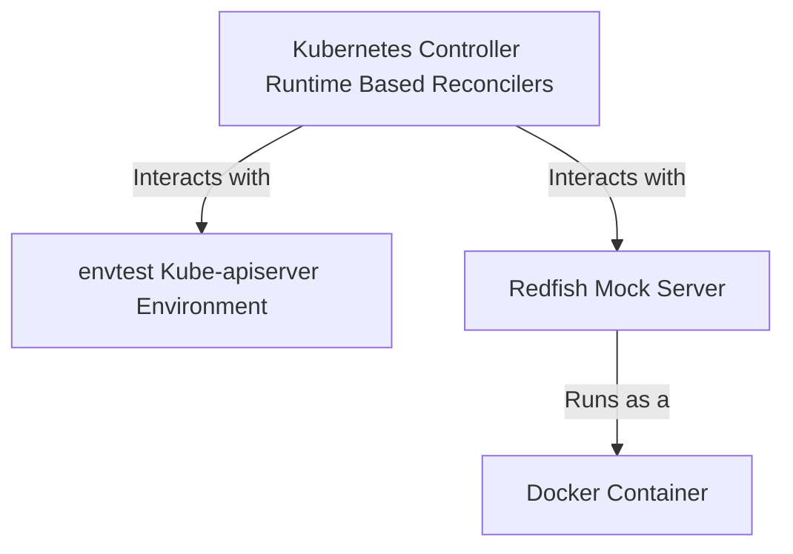

# Local Dev Setup

## Prerequisites

- go version v1.22.0+
- docker version 17.03+.
- kubectl version v1.28.0+.

## Overview

The `metal-operator` is leveraging [envtest](https://book.kubebuilder.io/reference/envtest.html) to conduct and run
unit test suites. Additionally, it is using the [Redfish Mock Server](https://github.com/DMTF/Redfish-Mockup-Server) to
run a local mock Redfish instance to simulate operations performed by various reconcilers.


```mermaid
graph TD
    A[Kubernetes Controller Runtime Based Reconcilers] -->|Interacts with| B[envtest Kube-apiserver Environment]
    A -->|Interacts with| C[Redfish Mock Server]
    C -->|Runs as a| D[Docker Container]
```

### Run the local test suite

The local test suite can be run via 

```shell
make test
```

This `Makefile` directive will start under the hood the Redfish mock server, instantiate the `envtest` environment
and run `go test ./...` on the whole project.

### Start/Stop Redfish Mock Server

The Redfish mock server can be started and stopped with the following command

```shell
make startbmc
make stopbmc
```

### Run the local Tilt development environment

#### Prerequisites

- [Tilt v0.33.17+](https://docs.tilt.dev/install.html)
- [Kind v0.23.0+](https://kind.sigs.k8s.io/docs/user/quick-start/)

The local development environment can be started via

```shell
make tilt-up
```

This `Makefile` directive will:
- create a local Kind cluster with local registry
- install cert-manager
- install [boot-operator](https://github.com/ironcore-dev/boot-operator) to reconcile the `ServerBootConfiguration` CRD
- start the `metal-operator` controller and Redfish mock server as a sidecar container
- an Endpoint resource is created to point to the Redfish mock server
- this will result in `Server` resources being created and reconciled by the `metal-operator`

```shell
‹kind-metal› kubectl get server
NAME                            SYSTEMUUID                             MANUFACTURER   POWERSTATE   STATE       AGE
compute-0-bmc-endpoint-sample   38947555-7742-3448-3784-823347823834   Contoso        On           Available   3m21s
```

The local development environment can be deleted via

```shell
make kind-delete
```

### Connecting a Remote BMC in the Tilt Environment

By default, Tilt runs against a local Redfish mock server. To point the environment at real hardware instead, apply the following changes.

#### Prerequisites: Claim the server on its origin cluster

Before pointing your local environment at a real BMC, ensure the server is not being reconciled by another metal-operator instance. On the cluster that originally owns the server, create a `ServerMaintenance` to claim it and power it off:

```yaml
apiVersion: metal.ironcore.dev/v1alpha1
kind: ServerMaintenance
metadata:
  name: <maintenance-name>
  namespace: default
  annotations:
    metal.ironcore.dev/maintenance-reason: "<maintenance-name>"
spec:
  policy: Enforced
  serverRef:
    name: <server-name>
  serverPower: "Off"
```

```shell
# Run against the remote cluster
kubectl apply -f servermaintenance-<node-name>.yaml
```

To release the server back when done:

```shell
# Run against the remote cluster
kubectl delete -f servermaintenance-<node-name>.yaml
```

> **Note:** All `kubectl` commands from this point on target the **local** Kind cluster.

#### 1. Replace the mockup endpoint with a real BMC resource

Edit `config/redfish-mockup/redfish_mockup_endpoint.yaml` to define a `BMC` resource targeting the real hardware:

```yaml
apiVersion: metal.ironcore.dev/v1alpha1
kind: BMC
metadata:
  name: <node-name>
spec:
  bmcSecretRef:
    name: <node-name>
  hostname: <bmc-hostname>
  consoleProtocol:
    name: SSH
    port: 22
  access:
    ip: <bmc-ip>
  protocol:
    name: Redfish
    port: 443
    scheme: https
```

#### 2. Create a BMCSecret with credentials

Apply a `BMCSecret` with base64-encoded credentials for the BMC:

```yaml
apiVersion: metal.ironcore.dev/v1alpha1
kind: BMCSecret
metadata:
  name: <node-name>
data:
  username: <base64-encoded-username>
  password: <base64-encoded-password>
```

#### 3. Enable HTTPS for the BMC connection

The manager defaults to `--insecure=true`, which uses plain HTTP. For a real BMC on port 443, set `--insecure=false` in the `Tiltfile` to use HTTPS instead:

```python
settings = {
    "new_args": {
        "metal": [
            # ...
            "--insecure=false",
        ],
    }
}
```

#### 4. Claim the server with a ServerMaintenance

Once the `Server` resource has been discovered and is `Available`, create a `ServerMaintenance` to claim it for local development. This prevents the server from being allocated by other consumers and powers it off:

```yaml
apiVersion: metal.ironcore.dev/v1alpha1
kind: ServerMaintenance
metadata:
  name: <maintenance-name>
  namespace: default
  annotations:
    metal.ironcore.dev/maintenance-reason: "<maintenance-name>"
spec:
  policy: Enforced
  serverRef:
    name: <server-name>
  serverPower: "Off"
```

Apply and delete it with:

```shell
kubectl apply -f servermaintenance-<node-name>.yaml
kubectl delete -f servermaintenance-<node-name>.yaml
```

#### Optional: Use the debug manager image

To get a shell-accessible manager image with `curl` and `ca-certificates` (useful for diagnosing BMC connectivity), switch the Tilt build target to `manager-debug`:

In `Tiltfile`:
```python
docker_build('controller', '.', target = 'manager-debug')
```

And add the corresponding stage to `Dockerfile`:
```dockerfile
FROM debian:testing-slim AS manager-debug
LABEL source_repository="https://github.com/ironcore-dev/metal-operator"
WORKDIR /
COPY --from=manager-builder /workspace/manager .
COPY config/manager/ignition-template.yaml /etc/metal-operator/ignition-template.yaml
RUN apt-get update && apt-get install -y --no-install-recommends \
    ca-certificates curl && \
    rm -rf /var/lib/apt/lists/*
ENTRYPOINT ["/manager"]
```
