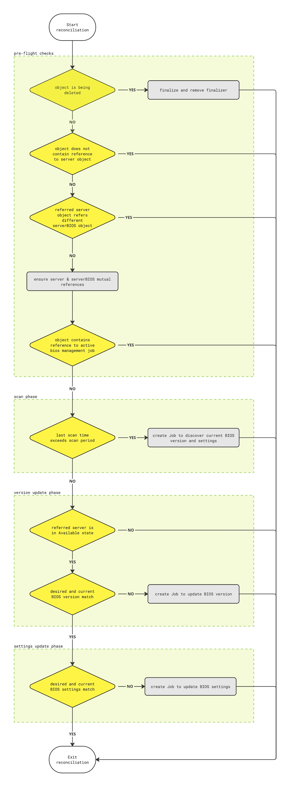
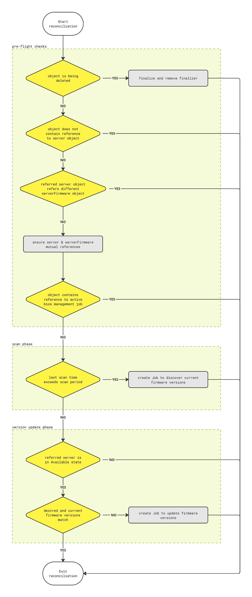

# OEP-0001: Server BIOS/Firmware update

## Table of Contents

- [Summary](#summary)
- [Motivation](#motivation)
    - [Goals](#goals)
    - [Non-Goals](#non-goals)
- [Proposal](#proposal)
    - [Custom resources](#custom-resources)
        - [ServerBIOS](#serverbios)
        - [ServerFirmware](#serverfirmware)
    - [Controllers](#controllers)
        - [configuration](#configuration)
        - [serverbios-controller](#serverbios-controller)
        - [serverfirmware-controller](#serverfirmware-controller)
- [Alternatives](#alternatives)

## Summary

Linked issue: [#99 BIOS/Firmware Update](https://github.com/ironcore-dev/metal-operator/issues/99)
PoC implementation: [#138 PoC: BIOS version & settings management](https://github.com/ironcore-dev/metal-operator/pull/138) (includes only )

The following is a concept of a solution aimed to solve listed problems in regard to hardware servers' BIOS/Firmware updates.
The following sections guide through:

- Kubernetes API types, which represent servers' firmware state;
- Kubernetes controllers, which reconcile these API types;

Throughout this document, the words are used to define and the significance of particular requirements is capitalized:

- `MUST` or `REQUIRED` means that the item is mandatory requirement;
- `MUST NOT` means that the item is an absolute prohibition;
- `SHOULD` or `RECOMMENDED` means that there may exist valid reasons in particular circumstances for not complying with an item;
- `SHOULD NOT` means that there may exist valid reasons in particular circumstances when listed behavior is acceptable;
- `MAY` or `OPTIONAL` means that the item is truly optional;

Throughout this document, the following terminology is used:

- `controller`: the unit which watches for the particular Kubernetes resource and executes reconciliation logic;
- `job` or `job executor`: the execution item, that runs concrete implementation of a specific task on target hardware server. MIGHT be vendor-specific;

The approach described in below allows to separate the vendor-agnostic common workflow and the concrete update job implementations that might be vendor-specific.

## Motivation

It is necessary to provide a robust, reliable and scalable solution to automate servers' firmware updating process.
Aside from that, it SHOULD also be as much kubernetes-native as possible.
It SHOULD provide a clear and concise API.
It SHOULD provide the ability to automate the update process along with the ability to override common settings in particular circumstances for particular servers.

### Goals

The following list gives general design goals for BIOS/Firmware updates:

- the solution SHOULD be vendor-agnostic aside from concrete scan/update job implementation;
- the solution SHOULD allow automated hardware servers' firmware lifecycle maintaining;
- the solution MUST be extensible by the possibility of adding vendor-specific job implementations;
- the solution SHOULD be as kubernetes-native as possible;

### Non-Goals

## Proposal

### Custom resources

The following CRs aimed to represent the current state of a particular server:

- [ServerBIOS](#serverbios)
- [ServerFirmware](#serverfirmware)

All these CRs MUST be cluster-scoped.

#### ServerBIOS

`ServerBIOS` CR represents the desired BIOS version and settings of concrete hardware server.
The `.spec` of this type contains:

- the reference to the `Server` object;
- desired BIOS version and BIOS settings;
- the duration in minutes after which information listed in object's `.status` considered to be outdated;

The `.status` of this type contains:

- information about the BIOS version and settings which are actually applied;
- the timestamp when this information was updated;
- a reference to the running scan/update job if any.

```yaml
apiVersion: metal.ironcore.dev/v1alpha1
kind: ServerBIOS
metadata:
  name: foo
spec:
  scanPeriodMinutes: 30
  serverRef:
    name: bar
  bios:
    version: 1.0.0
    settings: {}
status:
  lastScanTime: 01-01-2001 00:00:00
  bios:
    version: 0.1.0
    settings: {}
  runningJob:
    name: foobar
    namespace: default
```

The target `Server` object MUST also contain the reference to the `ServerBIOS` object.
The `.status.bios.settings` map MUST contain only keys exist in `.spec.bios.settings` map.

#### ServerFirmware

`ServerFirmware` CR represents the desired state of concrete hardware server.
The `.spec` of this type contains:

- the reference to the `Server` object;
- the list of firmwares desired to be installed;
- the duration in minutes after which information listed in object's `.status` considered to be outdated;

The `.status` of this type contains:

- information about the firmware versions which are actually installed on the server;
- the timestamp when this information was updated;
- a reference to the running scan/update job if any.

```yaml
apiVersion: metal.ironcore.dev/v1alpha1
kind: ServerFirmware
metadata:
  name: foo
spec:
  scanPeriodMinutes: 30m
  serverRef:
    name: bar
  firmwares:
    - name: ssd
      manufacturer: ACME Corp.
      version: 1.0.0
    - name: nic
      manufacturer: Intel
      version: 2.0.0
status:
  lastScanTime: 01-01-2001 01:00:00
  firmwares:
    - name: ssd
      manufacturer: ACME Corp.
      version: 1.0.0
    - name: nic
      manufacturer: Intel
      version: 2.0.0
  runningJob:
    name: foobar
    namespace: default
```

### Controllers

- [configuration](#configuration)
- [serverbios-controller](#serverbios-controller) (reconciles `ServerBIOS` CR)
- [serverfirmware-controller](#serverfirmware-controller) (reconciles `ServerFirmware` CR)

#### Configuration

Solution MUST provide a flexible yet transparent way to configure job runners. The minimal configuration provided:

- MUST include container image to be run as job executor;
- SHOULD include specific `ServiceAccount` reference to be used by job executor to get and update cluster resources;
- SHOULD include specific namespace in which job executors will run;
- MAY specify where to get updated versions to install;
- MAY include reference to specific configuration;

There are a number of approaches that can be used to provide the configuration.

##### Command-line arguments

Providing of necessary configuration using command-line arguments on controller's start.

PROS:

CONS:
- controller restart required to change configuration;
- implementation of complex configuration will lead to the mess in command-line args;

##### ConfigMap

Providing of necessary configuration using native Kubernetes `ConfigMap`.
`ConfigMap` SHOULD be referenced using command-line argument.

PROS:
- reading configuration right before use allow the re-configuration without controller restart;

CONS:
- schemaless nature of `ConfigMap` data requires additional validation;
- forcing end-users to create `ConfigMap`'s with specific data format;

##### CustomResource

Providing of necessary configuration using custom resource.

PROS:
- reading configuration right before use allow the re-configuration without controller restart;
- easy to implement validation;
- leveraging of built-in Kubernetes mechanisms, like label selectors, can be used for mapping between configuration and server bios/firmware objects;

CONS:
- necessity to maintain API versions;

#### serverbios-controller

This controller reconciles `ServerBIOS` CR.
When a `ServerBIOS` object is being reconciled, the controller MUST invoke a scan job in case `.status.lastScanTime` exceeds the `.spec.scanPeriodMinutes`.
When the `Job` object is created, the controller MUST update `ServerBIOS` object's `.status.runningJob` field with the reference to created job.
Scan job MUST update corresponding `ServerBIOS` object's status on completion:

- update `.status.bios.version` field
- update `.status.bios.settings` field
- update `.status.lastScanTime` field
- remove reference to job in `.status.runningJob` field

When an object contains up-to-date info in `.status.bios` field, the controller MUST check whether the target `Server` is in "Available" state.
If the server is not in "Available" state, then reconciliation stops.
Otherwise, the controller MUST compare the desired and current BIOS versions stored in `.spec.bios.version` and `.status.bios.version` fields accordingly.
If BIOS versions do not match, the controller MUST invoke BIOS version update job.
When the `Job` object is created, the controller MUST update `ServerBIOS` object's `.status.runningJob` field with the reference to created job.
BIOS version update job MUST update corresponding `ServerBIOS` object's status on completion:

- update `.status.bios.version` field
- remove reference to job in `.status.runningJob` field

When a `ServerBIOS` object's desired and current BIOS versions match, the controller MUST compare the desired and current BIOS settings stored in `.spec.bios.settings` and `.status.bios.settings` fields accordingly.
If there is discrepancy between desired and current settings, the controller MUST invoke BIOS settings update job.
When the `Job` object is created, the controller MUST update `ServerBIOS` object's `.status.runningJob` field with the reference to created job.
BIOS settings update job MUST update corresponding `ServerBIOS` object's status on completion:

- update `.status.bios.settings` field
- remove reference to job in `.status.runningJob` field

<details>
    <summary>Reconciliation flow diagram</summary>
    
</details>

#### serverfirmware-controller

This controller reconciles `ServerFirmware` CR.
When a `ServerFirmware` object is being reconciled, the controller MUST invoke a scan job in case `.status.lastScanTime` exceeds the `.spec.scanPeriodMinutes`.
When the `Job` object is created, the controller MUST update `ServerFirmware` object's `.status.runningJob` field with the reference to created job.
Scan job MUST update corresponding `ServerFirmware` object's status on completion:

- update `.status.firmwares` field
- update `.status.lastScanTime` field
- remove reference to job in `.status.runningJob` field

When an object contains up-to-date info in `.status.firmwares` field, the controller MUST check whether the target `Server` is in "Available" state.
If the server is not in "Available" state, then reconciliation stops.
Otherwise, the controller MUST compare the desired and current firmware versions stored in `.spec.firmwares` and `.status.firmwares` fields accordingly.
If there is discrepancy between desired and current firmware versions, the controller MUST invoke firmware update job.
When the `Job` object is created, the controller MUST update `ServerFirmware` object's `.status.runningJob` field with the reference to created job.
Firmware versions update job MUST update corresponding `ServerFirmware` object's status on completion:

- update `.status.firmwares` field
- remove reference to job in `.status.runningJob` field

<details>
    <summary>Reconciliation flow diagram</summary>
    
</details>

## Alternatives
