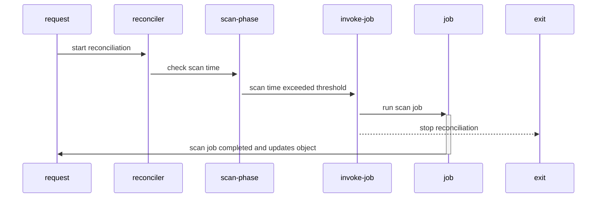
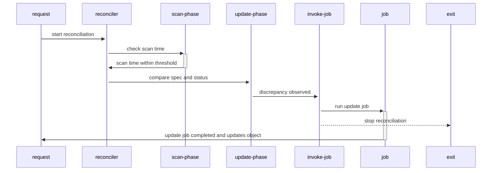

# OEP-0001: Server BIOS/Firmware update

## Table of Contents

- [Summary](#summary)
- [Motivation](#motivation)
    - [Goals](#goals)
    - [Non-Goals](#non-goals)
- [Proposal](#proposal)
    - [Custom resources](#custom-resources)
        - [ServerFirmware](#serverfirmware)
        - [AvailableFirmware](#availablefirmware)
    - [Firmware operator](#firmware-operator)
        - [configuration](#configuration)
        - [server-controller](#server-firmware-controller)
        - [webhooks](#admission-webhooks)
- [Alternatives](#alternatives)

## Summary

Linked issue: [#99 BIOS/Firmware Update](https://github.com/ironcore-dev/metal-operator/issues/99)

The following is a concept of a solution aimed to solve listed problems in regard to hardware servers' BIOS/Firmware updates.
The following sections guide through:

- Kubernetes API types, which represent servers' firmware state;
- Kubernetes operator, which reconciles these API types;

Throughout this document, the words are used to define and the significance of particular requirements is capitalized:

- `MUST` or `REQUIRED` means that the item is mandatory requirement;
- `MUST NOT` means that the item is an absolute prohibition;
- `SHOULD` or `RECOMMENDED` means that there may exist valid reasons in particular circumstances for not complying with an item;
- `SHOULD NOT` means that there may exist valid reasons in particular circumstances when listed behavior is acceptable;
- `MAY` or `OPTIONAL` means that the item is truly optional;

Throughout this document, the following terminology is used:

- `firmware operator`: the application running as a workload in Kubernetes cluster, interacting with Kubernetes API. It reconciles custom resources (hereafter CR) related to servers' firmware update workflow;
- `update job`: the execution item, which runs concrete implementation of the BIOS/firmware update routine on target hardware server;
- `scan job`: the execution item, which runs concrete implementation for scanning of the firmware installed on target hardware server;
- `update strategy`: the path chosen to apply updates, e.g.: pre-built boot image with updates, docker image with baked updates, vendor-specific CLI tool, etc.;

The approach described in below allows to separate the vendor-agnostic common workflow and the concrete update job implementations that might be vendor-specific.

## Motivation

It is necessary to provide a robust, reliable and scalable solution to automate servers' firmware updating process.
Aside from that, it SHOULD also be as much kubernetes-native as possible.
It SHOULD provide a clear and concise API.
It SHOULD provide the ability to automate the update process along with the ability to override common settings in particular circumstances for particular servers.

### Goals

The following list gives general design goals for BIOS/Firmware updates:

- the solution SHOULD be vendor-agnostic aside from concrete scan/update job implementation;
- the solution SHOULD allow automated hardware servers' firmware lifecycle maintaining;
- the solution MUST be extensible by the possibility of using plugins for update strategy;
- the solution MUST be extensible by the possibility of adding vendor-specific update job implementations;
- the solution SHOULD be as kubernetes-native as possible;

### Non-Goals

## Proposal

### Custom resources

The following CRs aimed to represent the current state of a particular server and available firmware versions for a particular manufacturer-model:

- [ServerFirmware](#serverfirmware)
- [AvailableFirmware](#availablefirmware)

All the following CRs MUST be cluster-scoped.

#### ServerFirmware

`ServerFirmware` CR represents the desired state of concrete hardware server.
The `.spec` of this type references the `Server` object, reflects its `.status.bios` field into `.spec.bios` field and contains the list of firmwares desired to be installed.
The `.status` of this type contains information about the BIOS/firmware versions which are actually installed on the server.
Aside from that `.spec` contains the scan threshold and the `.status` contains last scan operation timestamp.
These two fields required to make decision whether the scanning for installed firmware is required or not.
The `ServerFirmware` object SHOULD be created along with corresponding `Server` object and MUST be unique across the cluster.

```yaml
apiVersion: metal.ironcore.dev/v1alpha1
kind: ServerFirmware
metadata:
  name: foo
spec:
  scanThreshold: 30m
  serverRef:
    name: foo
  bios:
    version: 1.0.0
  firmwares:
    - name: ssd
      manufacturer: ACME Corp.
      version: 1.0.0
    - name: nic
      manufacturer: Intel
      version: 2.0.0
status:
  lastScanTime: 01-01-2001 01:00:00
  bios:
    version: 1.0.0
  firmwares:
    - name: ssd
      manufacturer: ACME Corp.
      version: 1.0.0
    - name: nic
      manufacturer: Intel
      version: 2.0.0
```

#### AvailableFirmware

`AvailableFirmware` CR represents available firmware versions for a specific manufacturer-model.
The `.spec` of this type contains

- manufacturer
- model
- the desired number of versions to store
- the list of firmwares and their versions available for specified manufacturer-model pair

Each entry represents the name of individual firmware and the list of available versions sorted in ascending order.
The maximum length of this list MUST NOT exceed the value defined in `.spec.versionsHistory`.
In case of automated objects creation, the `AvailableFirmware` object SHOULD be created as soon as a new manufacturer-model pair was discovered
The `AvailableFirmware` object MUST be unique across the cluster basing on manufacturer-model pair.

```yaml
apiVersion: metal.ironcore.dev/v1alpha1
kind: AvailableFirmware
metadata:
  name: baz
spec:
  manufacturer: Lenovo
  model: 7x21
  versionsHistory: 3
  bios:
    versions: [1.0.0]
  firmwares:
    - name: ssd
      manufacturer: ACME Corp.
      version: [1.0.0, 1.1.0, 1.2.0]
    - name: nic
      manufacturer: Intel
      version: [1.5.0, 1.7.0, 2.0.0]
status: {}
```

### Firmware operator

This is an application that watches and reconciles CRs listed in the previous section.
It consists of the following controllers:

- [server-firmware-controller](#server-firmware-controller) (reconciles `ServerFirmware` CR)

#### Configuration

Operator's configuration:

- MUST contain update strategy, i.e.:
  - "BootFromImage", server boots from prepared boot image with update tool;
  - "RedFish", updates are installed remotely using redfish API;
  - etc.;

  Update strategy entries MUST be mutual exclusive;
- Update strategy entry MUST contain mapping for vendor and boot image, mapping for vendor and job executor image, etc., depending on strategy;
- MAY contain source of the bios/firmware updates;

#### server-firmware-controller

This controller reconciles `ServerFirmware` CR.
When an object of this kind is being reconciled, the controller MUST invoke a scan job in case `.status.lastScanTime` exceeds the `.spec.scanThreshold`.
Scan job MUST update corresponding `ServerFirmware` object's `.status` with installed firmware versions.
After the object becomes updated, the controller computes the difference between desired state defined in object's `.spec` and actual state reflected in object's `.status`.
If there is discrepancy observed between these two states, then `server-firmware-controller` MUST set **"Maintenance"** state for target server and invoke an update job.
After invoking any of the mentioned job types, `server-firmware-controller` MUST stop reconciliation by returning an empty result and an error if any, otherwise empty result and nil value.
Invoked jobs depend on chosen update strategy and its configuration provided to operator.

Reconciliation workflow when scan required:



Reconciliation workflow when update required:



#### Admission webhooks

Firmware operator SHOULD implement validating webhooks for provided CRs.
Webhook for `AvailableFirmware` MUST validate:

- on CREATE that objects to be created are unique across the cluster;

Webhook for `ServerFirmware` MUST validate:

- on CREATE that objects to be created are unique across the cluster;
- on UPDATE that object's spec contains only bios/firmware versions listed in corresponding `AvailableFirmware` object;

## Alternatives
