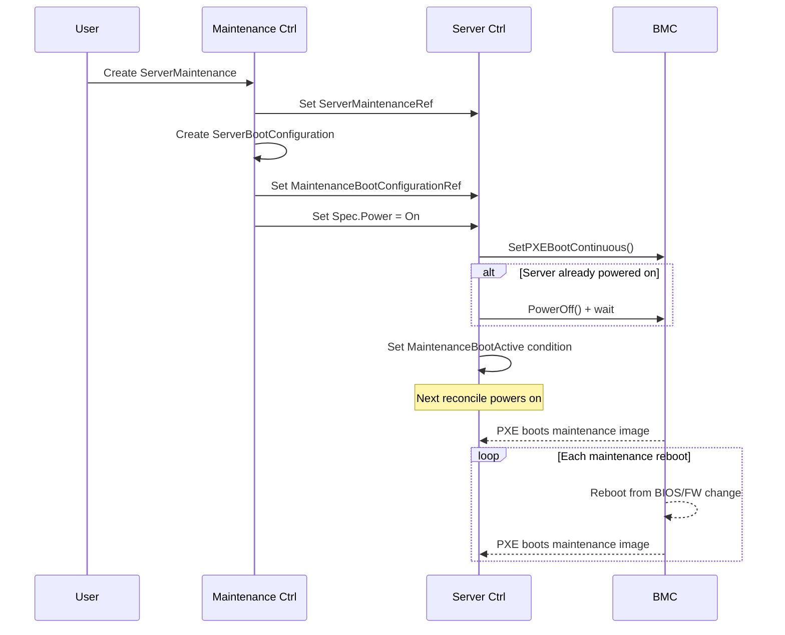
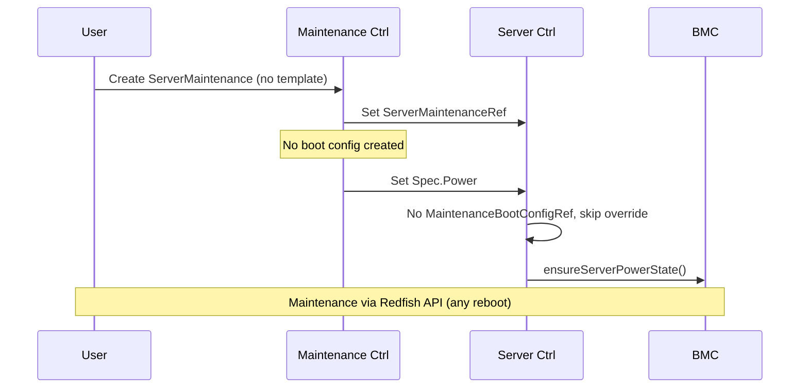
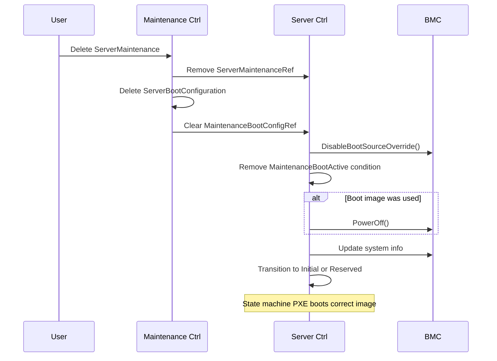

# Proposal: Persistent Boot Override for Maintenance

## Problem

When a server enters maintenance with a `ServerBootConfigurationTemplate`, the maintenance controller creates a `ServerBootConfiguration` and sets `server.Spec.Power` to the desired state. However, no boot override is applied — the server boots from its default boot order rather than the maintenance boot image.

This is a problem for maintenance workflows that involve multiple reboots:

1. BIOS settings applied via Redfish → server reboots to apply
2. Firmware update applied → server reboots again
3. Each reboot should land in the maintenance image, not the production OS

Without a persistent boot override, the server reboots into the production OS after each step, causing the application to restart, rejoin its cluster, and take traffic — only to be disrupted again by the next maintenance reboot.

## Use Cases

| Use Case | Needs Boot Image | Needs Reboot | Notes |
|----------|:---:|:---:|-------|
| Apply BMC Settings | No | No | Redfish API only; BMC may reset independently |
| Apply BIOS Settings | No | Yes | Applied via Redfish, takes effect after reboot |
| Update BMC Firmware | No | No | Redfish `SimpleUpdate`; BMC resets independently |
| Update Server BIOS | Maybe | Yes | Some vendors use Redfish `SimpleUpdate`, others need a boot image |
| Update Server Firmware | Maybe | Depends | NIC/storage firmware may need a special boot environment |
| Hardware Diagnostics | Yes | Yes | Vendor diagnostic tools run from a dedicated image |

Use cases fall into three categories:

1. **No reboot needed** — BMC settings, BMC firmware. Maintenance mode only protects the server from being reclaimed. Current implementation is sufficient.

2. **Reboot needed, no boot image** — BIOS settings (single change). Server reboots and returns to normal. Current `ServerPower` mechanism works, but if combined with other steps (category 3), a boot image is preferred.

3. **Boot image needed** — Firmware updates, diagnostics, or any multi-step workflow with reboots. The maintenance boot image acts as a safe landing zone: every reboot returns to the lightweight maintenance image instead of the production OS. The application starts only once, when maintenance is complete.

## Current Behavior

### Entry (ServerMaintenance controller)

1. `handlePendingState`: Sets `server.Spec.ServerMaintenanceRef` → Server controller transitions to `Maintenance`
2. `handleInMaintenanceState`:
   - Creates `ServerBootConfiguration` from template (if provided)
   - Sets `MaintenanceBootConfigurationRef` on the Server
   - Waits for boot config to become `Ready`
   - Patches `server.Spec.Power` to desired state (e.g., `On`)

**Gap**: No boot source override is set on the BMC. The server powers on and boots from its default boot order.

### During Maintenance (Server controller)

`handleMaintenanceState`: Calls `ensureServerPowerState()` only. No boot override logic.

**Gap**: If the server reboots (BIOS change, firmware update, manual reset), it boots from its default boot order.

### Exit (ServerMaintenance deletion)

1. Removes `ServerMaintenanceRef` from Server
2. Deletes maintenance `ServerBootConfiguration`
3. Clears `MaintenanceBootConfigurationRef`
4. Server controller transitions to `Initial` (unclaimed) or `Reserved` (claimed)

**Gap**: No boot override is cleared, because none was set.

## Proposed Changes

### 1. BMC Interface

Add two new methods to `bmc/bmc.go` alongside the existing `SetPXEBootOnce`:

- `SetPXEBootContinuous(ctx, systemURI)` — sets the boot source override to PXE with `Continuous` mode, so the server network-boots on every reboot until explicitly disabled.
- `DisableBootSourceOverride(ctx, systemURI)` — disables any active boot source override, restoring the server to its configured boot order.

### 2. Redfish Implementation

In `bmc/redfish.go`, add `SetPXEBootContinuous` and `DisableBootSourceOverride` on `RedfishBaseBMC`.

- `SetPXEBootContinuous` follows the same pattern as `SetPXEBootOnce` but uses `schemas.ContinuousBootSourceOverrideEnabled` instead of `schemas.OnceBootSourceOverrideEnabled`.
- `DisableBootSourceOverride` calls `system.SetBoot()` with `schemas.DisabledBootSourceOverrideEnabled`.

Vendor-specific implementations (Dell, HPE, Lenovo, Supermicro) inherit from `RedfishBaseBMC` and get these methods for free. Override only if vendor-specific behavior is needed.

### 3. Server Controller — Maintenance Entry

Update `handleMaintenanceState` in `internal/controller/server_controller.go`:

- When `MaintenanceBootConfigurationRef` is set, call `ensureMaintenanceBootOverride`:
  1. Wait for the maintenance `ServerBootConfiguration` to be Ready (boot-operator has resolved the image). If not ready, return and requeue — do not set overrides or power cycle yet.
  2. Check `MaintenanceBootActive` condition — if present, the override is already active; skip.
  3. Set `SetPXEBootContinuous` on the BMC.
  4. If the server is already powered on, gracefully power it off (+ wait). On the next reconcile, `ensureServerPowerState` sees the server is off with `Spec.Power = On` and powers it on — booting into the maintenance image via the continuous PXE override.
  5. If the server is already powered off, no action needed — `ensureServerPowerState` handles power-on normally.
  6. Set `MaintenanceBootActive` condition (True) to prevent repeated power cycles on subsequent reconciles.
- When `MaintenanceBootConfigurationRef` is nil (no boot image requested), no boot override is set — current behavior preserved.

### 4. Server Controller — Maintenance Exit

When `ServerMaintenanceRef` is removed in `handleMaintenanceState`:

- Call `DisableBootSourceOverride` to restore the server's configured boot order.
- Remove the `MaintenanceBootActive` condition from the Server (absent = false; avoids accumulating stale conditions).
- If a maintenance boot image was used (condition was present), power off the server. This lets the existing state machine handle the transition:
  - **Reserved** (`ServerClaimRef` set): `handleReservedState` sees the server is off, calls `SetPXEBootOnce`, powers it on → server boots into production image.
  - **Initial** (no claim): `handleInitialState` creates a discovery boot config, PXE boots → normal discovery flow.
- Update system info from BMC (hardware may have changed during maintenance).
- Transition to `Initial` (unclaimed) or `Reserved` (claimed).

## Lifecycle Flow

### Entry with boot image
<!-- /mermaid -->

### Entry without boot image

### Exit

